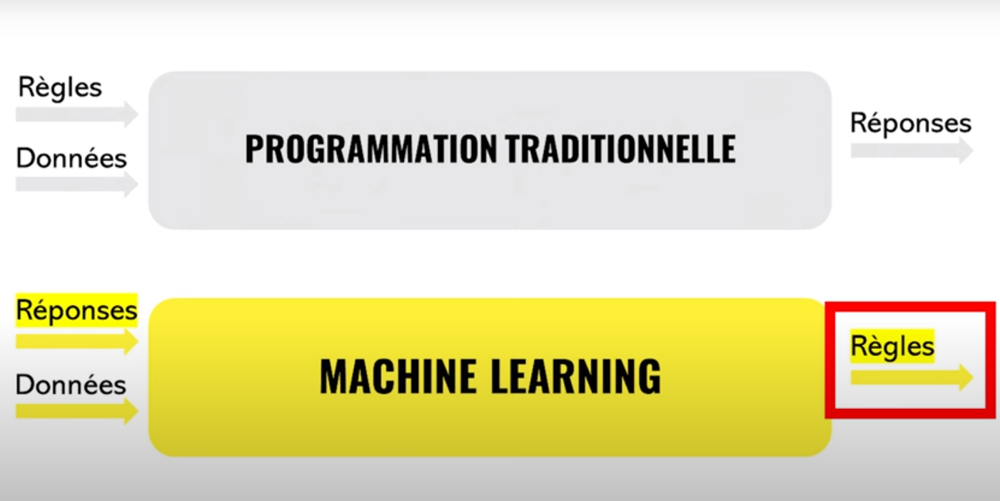

# Module 2 : Data Science :pencil:

Welcome to this second module young scientist, you are now comfortable with Python it is time to enter the world of artificial intelligence.

# Data & AI :mag_right:

Data is at the center of any artificial intelligence development, indeed the idea is that when we develop a program we use rules and data to obtain a result, for AI we use data and results for our model to define the rules.

In reality this scheme corresponds to a specific type of learning which is supervised, but in any case we will need data to develop a model.

And often when we talk about data, we talk about huge amounts of data "Big Data". And all this data must be preprocessed before being used in an AI development. This is the role of the data scientist.

For example, some data may not be relevant or may need to be cleaned up to be usable. It is even common to create new data from existing data.

In this activity you will have to perform operations on the data of the Titanic passengers in order to draw conclusions. You will be able to answer questions such as:

- Does age affect the chances of survival?
- Does money influence the chances of survival?
- Does gender affect survival chances?
- Does age affect travel class?

But you will also be able to select the best data to predict if a person would have survived this shipwreck. For the faster ones, you will have the opportunity to use the scikit-learn library to apply different machine learning algorithms.

## Submit :trophy:

Fill the notebook : ``Data science.ipynb``

To submit your work, think about pushing your changes. It is important to push so that we are able to assess participation.
If you have any concerns, talk to a supervisor.

## Resources :book:

- [Doc pandas](https://pandas.pydata.org/docs/) :heart:
- [Doc scikit-learn](https://scikit-learn.org/stable/)
- [Comprendre le Machine Learning en 5min](https://www.youtube.com/watch?v=RC7GTAKoFGA)
- [What is Pandas](https://www.youtube.com/watch?v=dcqPhpY7tWk)
- [Learn Pandas 1H](https://www.youtube.com/watch?v=vmEHCJofslg)
- [Linear regression with scikit-learn](https://stackabuse.com/linear-regression-in-python-with-scikit-learn/)
