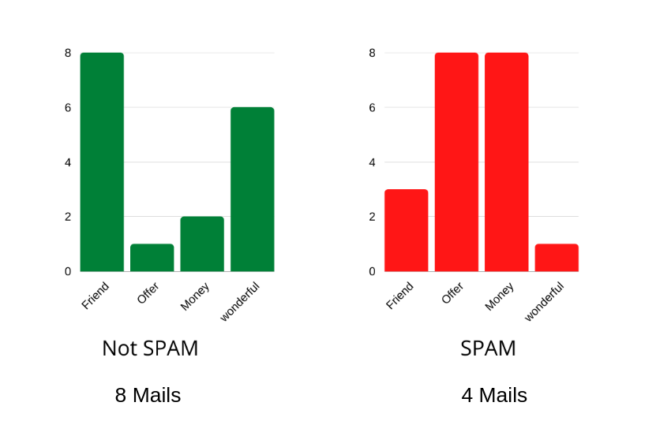

# Module 4: Multinomial Naive Bayes :pencil:

You have discovered the KNN algorithm previously, in this module you will discover the Naive bayes method and more precisely the multinomial naibe bayes algorithm which allows for example the creation of anti-spam filters.

## Multinomial Naive Bayes :e-mail:

Naive Bayesian classification is a type of classification based on probabilities, and on Bayes' theorem. It is a simple method of machine learning to set up, and especially to use for a basic text processing.

Before starting it is important to make the precision that we are going to work on the Multinomial Bayesian Classification which allows to work with discrete values like the number of words in an email. For a more general case we will use the Bayesian Gaussian Classification, which we will not see in this pool but if you have the time and the desire to go deeper you can apply the Bayesian Gaussian Classification to the flower dataset that you had in the KNN topic, you should get an accuracy similar to that of algo KNN.

Now, the best way to explain it is to give you an example.

We will calculate the probability that each word appears in a spam email, and a non-spam email. Then we will be able to calculate the conditional probability that an email is spam or not depending on the words it contains. This algorithm is called naive because it does not take into account the context in which the word appears unlike the more advanced Natural language processing algorithms that you will see later in the week.

## Submit :trophy:

To submit your work, think about pushing your changes. It is important to push so that we are able to assess participation.
If you have any concerns, talk to a supervisor.

## Resources :book:

 - [Article : Multinomial Naive Bayes explained](https://www.mygreatlearning.com/blog/multinomial-naive-bayes-explained/)
 - [Video : Multinomial Naive Bayes, clearly explained!!!](https://www.youtube.com/watch?v=O2L2Uv9pdDA)
 - [Video : Gaussian Naive Bayes](https://www.youtube.com/watch?v=H3EjCKtlVog)
 