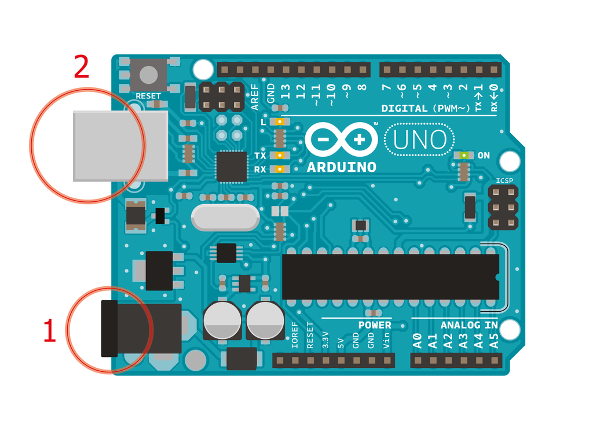
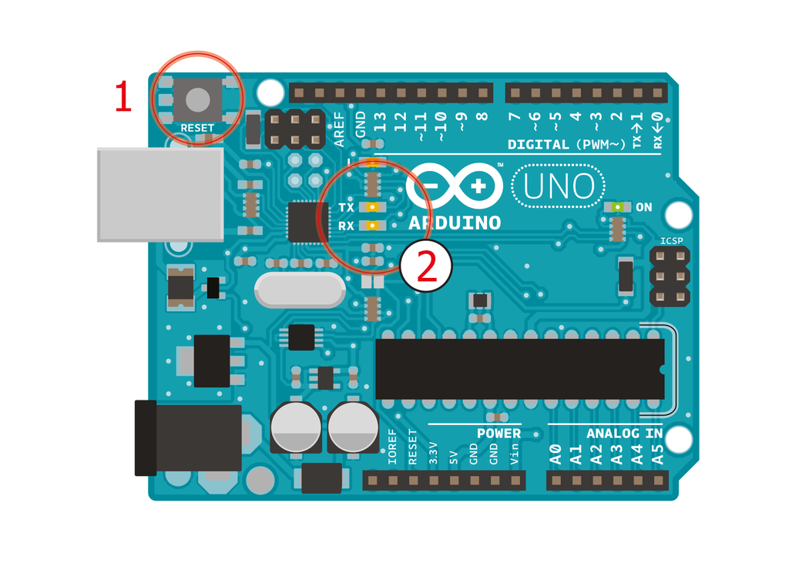
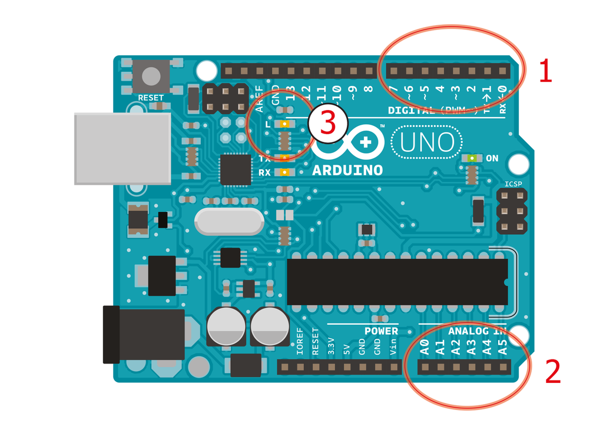
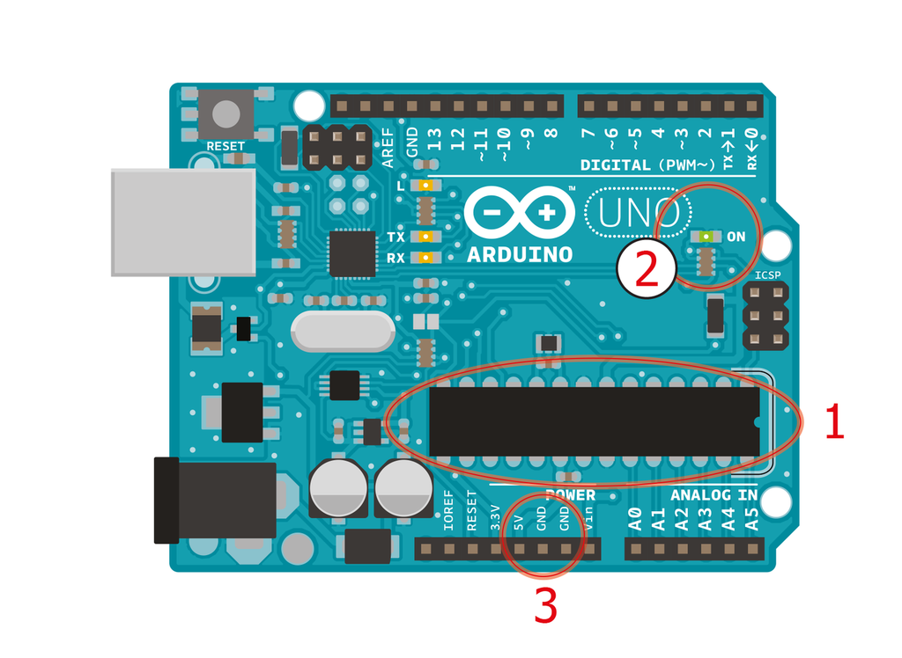

# Arduino Card

  
1. ***Power connector*** - This is how you power your Arduino when it is not connected to a USB port. It can accept voltages between 7 and 12V. 
2. ***USB port*** - Used to power your Arduino Uno, upload (download) your sketches (programs) to your Arduino, and communicate with your Arduino sketch. 

  
1.  ***Reset Button*** - Resets the ATmega microcontroller. You may have to use it if your card does not behave as you want. 
2.  ***TX et RX LEDs*** - These LEDs indicate the communication between your Arduino and your computer. Expect them to blink rapidly while the sketch is being uploaded and while the board is communicating with the computer. These lights are useful for debugging.

  
1. ***Digital pins*** - Interpretation of binary data (on or off) of an input component as a switch. You will learn that digital pins are used with `digitalRead(), digitalWrite() and analogWrite(). analogWrite()` works only on pins with the PWM (pulse width modulation) symbol.
2. ***Analog pins*** - Interpret a range of signals from an input component. Use these pins with analogRead().
3. ***Pin 13 LED*** - The only output integrated in your Arduino Uno. This LED is very useful for debugging. 

  
1. ***ATmega microcontroller*** - The brain of your Arduino Uno!
2. ***Power LED*** - Indicates that your Arudino is powered. This light is useful for debugging.
3. ***GND et 5V pins*** -  Use these pins to provide +5V power and 0V ground to your circuits.