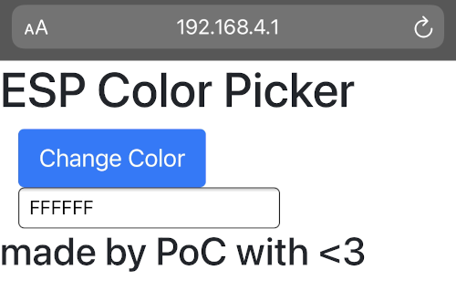

# PoC Hardware, Day2

## Sommaire
  - [Introduction](#introduction)
  - [0 - Setup](#0---setup)
  - [1 - USB](#1---usb)
    - [1.1 - Transmission's Frequencies](#11---transmission's-frequencies)
    - [1.2 - Reading messages in the monitor](#12---reading-messages-in-the-monitor)
    - [1.3 - Performing calculations](#13---performing-calculations)
  - [2 - Bluetooth](#2---bluetooth)
    - [2.1 - Create Server BLE](#21---create-server-ble)
    - [2.2 - Set Client with your phone](#22---set-client-with-your-phone)
    - [2.3 - Scan BLE](#23---scan-cle)
  - [3 - WiFi](#3---wifi)
    - [3.1 - Color Picker :syringe:](#31---color-picker-syringe)
      - [3.1.1 Controlling the LED](#311-controlling-the-led)
      - [3.1.2 Create your first Access Point](#312-create-your-first-access-point)
      - [3.1.3Web Server on ESP32](#313-web-server-on-esp32)
    - [3.2 - Among Us of RFC :detective:](#among-us-of-rfc-detective)
      - [3.2.1 Launch the API](#321-launch-the-api)
      - [3.2.2 Finding the imposters](#322-finding-the-imposters)
  - [4 - MQTT](#4---mqtt)
    - [4.1 - Connect to Wi-Fi](#41---connect-to-wi-fi)
    - [4.2 - SetUp Mosquitto](#42---setup-mosquitto)
    - [4.3 - SetUp your first Subscribe to Mosquitto](#43---setup-your-first-subscribe-to-mosquitto)
    - [4.4 - Publish with Mosquitto](#44---publish-with-mosquitto)
    - [4.5 - Set MQTT with your esp32](#45---set-mqtt-with-your-esp32)
    - [4.6 - Create your Broker](#46---create-your-broker)
    - [IFTT turn on LED with your vocal assistant ! :speaking_head:](#iftt-turn-on-led-with-your-vocal-assistant--speaking_head)

## Introduction

During this day, you will learn several `communication protocols` and develop projects around these protocols that are found everywhere in our daily lives!
And most importantly you will have a brief approach to `IOT` (Internet Of Things)

- Inter System Communication Protocols
  - USB  (Universal Serial Bus)
  - UART (Universal Asynchronous Receiver/Transmitter)
- Intra System Communication Protocols
  - I2C
  - SPI (Serial Peripheral Interface)
  - CAN (Controller Area Network)
- IR (InfraRed)
- Bluetooth 5 and BLE (Bluetooth Low Energy)
- MQTT (MosQuito Telemetry Transport)
- Wifi (Wireless Fidelity)

## 0 - Setup

## 1 - USB

We will  establish a serial connection between our pc and our microprocessor.
To enable communication we will use the serial monitor.

### 1.1 - Transmission's Frequencies
In your setup you will set your transmission to 9600 baud.
Then still in your setup display *Hello World*.

You just have to open your serial monitor on 9600 baud to see your message.

### 1.2 - Reading messages in the monitor

Now that you have learned how to write messages, it is time to read the messages received through the input of your monitor.

Write a condition in your loop to check that a message is received and then display it. :muscle:

### 1.3 - Performing calculations

We know how to retrieve messages and how to write them, now we will store the received values to perform a calculation.

Create a function that retrieves two input values and adds them together. :heavy_plus_sign:
Once the calculation is done, return the value.

> :stuck_out_tongue_winking_eye: Don't forget to check that the variable are numbers.

## 2 - Bluetooth
Le BLE signifie Bluetooth Low Energy.

### 2.1 - Create Server BLE
<details>
    <summary> 🛠️ Required Hardware:</summary>

- ESP32
- USB cable

</details>

We will create a Bluetooth server with our ESP32.

> * Create your local bluetooth and set `BLE ESP32 - [YourName]` as local server name.

To verify that your server is created, take your phone and look at the Bluetooth networks.
If you manage to connect to yours, go to the next step!

### 📚 Documentation:
- [BLE Server](http://www.neilkolban.com/esp32/docs/cpp_utils/html/class_b_l_e_server.html)

### 2.2 - Set Client with your phone
<details>
    <summary> 🛠️ Required Hardware:</summary>

- ESP32
- USB cable

</details>

Now that we have a BLE server, we will define a client to communicate with our ESP32.<br/>
For this, we will use a mobile application: `Serial Bluetooth Terminal`.<br/>

- Go to `Devices`.
- Click the settings icon, and select Pair new device.
- Choose and pair with your BLE server.
:blub: Make sure you’ve enable your smartphone’s Bluetooth.
- Go back to the `Serial Bluetooth Terminal`.
- Click the icon at the top to connect to the BLE server.

You should get a `Connected` message.

:blub: You can send message between your monitor and `Serial Bluetooth Terminal` !

Let's continue to the next step!

### 2.3 - Scan BLE
<details>
    <summary> 🛠️ Required Hardware:</summary>

- ESP32
- USB cable

</details>

We will now create a bluetooth scanner with a second ESP32.

:blub: `#include <BLEScan.h>`, `#include <BLEAdvertisedDevice.h>` <br/>
> :warning: Be careful to upload one code at a time on each board. <br/>

If you find the name of your BLE server in the monitor of your scanner, you have succeeded!

### 📚 Documentation:
- [Scan BLE](http://www.neilkolban.com/esp32/docs/cpp_utils/html/class_b_l_e_scan.html)

## :tada: Congratulation !

You now know the basics of BLE ESP32.<br/>

## 3 - Wifi
### 3.1 - Color Picker :syringe:

Create your first `web server` on ESP32 to control the color of an RGB LED.

<details>
    <summary> 🛠️ Matériel requis:</summary>

* ESP32 - Breadboard - Jumpers
* LED RGB
* 3x Résistances

</details>

#### 3.1.1 Controlling the LED
To begin our program, start by driving your RGB LED with the ESP32.
To do this you will have to write the desired color in the `Serial Monitor` in this form: `r255g00b00&`. You will understand later.

> r for red, g for green, b for blue
> Let the number after each letter be between 0 and 255 (one byte)

Create the function whose header is below:
```arduino
void change_led_color(String header)
```

```diff
+Pour passer à la suite envoyé ses lignes+
r255g0b0& # rouge
r0g255b0& # vert
r0g0b255& # bleu
```
```diff
!~ Tips ~!
ledcSetup();
ledcAttachPin();

String.indexOf();
String.substring();
@@ ok @@
```

#### 3.1.2 Create your first Access Point
You will need to set the ESP32 to `AP'. And print the IP address of your card.
Name your network as follows:
```
RGB_yourName
```
Of course your code should be in the `setup` function of your code.

```diff
+To move on+
Go to your phone's WiFi settings and see if your Access Point is there.
```
```diff
!~ Tips ~!
WiFi.h
```
> ESP32 Useful Wi-Fi Library [Explication](https://randomnerdtutorials.com/esp32-useful-wi-fi-functions-arduino/)

#### 3.1.3 Web Server on ESP32
Now you need to create a ***server on port 80*** of your card.
Then you have to create your client, which will allow you to write the `htlm` on your server.
You will have to use `color_picker.html` which is located in `resouces/`.
The function to put the html code on your server will be built as follows:
```arduino
void web_color_picker(WiFiClient client)
```
```diff
!~ Tips ~!
WiFi.h
WiFiServer();
WiFiClient();
```
> Documentation [Create A Web Server](https://electropeak.com/learn/create-a-web-server-w-esp32/)
> An example code you should quickly understand [ESP32 Web Server - Arduino IDE](https://randomnerdtutorials.com/esp32-web-server-arduino-ide/)
> The [WiFi library](https://www.arduino.cc/en/Reference/WiFi) documentation
>
> :warning: You are not allowed to use the lib <WebServer.h> :)

If you have managed your loop well you can connect to your ESP32 and go to your `Phone WebBrowser` and type in the IP of your Card.
You should see it displayed:


### 3.2 - Among Us of RFC :detective:
#### 3.2.1 Launch the API

The purpose of this exercise is to send http requests to an API in the `resources/`.
You will find a `docker-compose.yml` there, so you will need to have **docker** installed on your machine and run the following command:
``bash
docker-compose up -d
```

The API runs on the `port 3000`. For more info on the API go to the route ***/about.json***.

http://localhost:3000/about.json

#### 3.2.2 Finding the imposters

<details>
    <summary> 🛠️ Required hardware:</summary>

* ESP32 - Breadboard - Jumpers
* 2x LEDs (Red/Green)
* 2x Resistors
* RFID-RC522 reader

</details>

Connect your PC and your ESP32 on the same network.
Thanks to the RFID reader and the provided cards and badges the goal will be to find out who the impostor is.
Scan the cards and badges, if it is an impostor turn on the red LED otherwise the green LED.

```diff
!~ Tips ~!
HTTPClient.h
```
## 4 - MQTT
The MQTT is a protocol allowing to connect several objects using different technologies.
### 4.1 - Connect to Wi-Fi
<details>
    <summary> 🛠️ Required Hardware:</summary>

- ESP32
- USB cable

</details>

### 📑 Description:

For this step, you will set ssid and password for connect your board to the WI-Fi. <br/>
Integred conditional state for print Wi-fi and Ip Address of your device. <br/>

* For print data you must use serial connection.
* The first purpose of the MQTT IOT is a Wi-Fi.

### 📌 Tasks:

- Print `ip` of your board in `serial monitor`

### 📚 Documentation:
- [ESP32 Wi-Fi configuration](https://tttapa.github.io/ESP8266/Chap07%20-%20Wi-Fi%20Connections.html)
- [Function to serial connection](https://www.arduino.cc/reference/en/language/functions/communication/serial/)
- [Init Serial Connection](https://www.arduino.cc/reference/en/language/functions/communication/serial/ifserial/)

### ✔️ Validation:

- Ping your device.
If this step is ending you can go out to the next step. :tada:


## 4.2 - SetUp Mosquitto

<details>
    <summary> 🛠️ Required Hardware:</summary>

- Your Computer

</details>

### 📑 Description:

Now that you have an network to your esp32. <br/>
This is the first step. <br/>
Then you must understand and work MQTT IoT. <br/>

- Take your computer and [download Mosquitto](https://everythingsmarthome.co.uk/howto/how-to-install-an-mqtt-broker-mosquitto-install-config-on-debian-ubuntu-mint-fedora-raspbian/). <br/>
- On this piece you have a [Broker MQTT](https://www.journaldunet.fr/web-tech/dictionnaire-de-l-iot/1440686-mqtt-comment-fonctionne-ce-protocole/) with a raspberry. <br/>

### 📌 Tasks:

* Call a manager to explain how a broker works. :wave:

### 📚 Documentation:
- [Download Mosquitto](https://everythingsmarthome.co.uk/howto/how-to-install-an-mqtt-broker-mosquitto-install-config-on-debian-ubuntu-mint-fedora-raspbian/)
- [Broker MQTT](https://www.journaldunet.fr/web-tech/dictionnaire-de-l-iot/1440686-mqtt-comment-fonctionne-ce-protocole/)

## 4.3 - SetUp your first Subscribe to Mosquitto

<details>
    <summary> 🛠️ Required Hardware:</summary>

- Your computer

</details>

### 📑 Description:

Now it's time to know how subscribes to a topic.

### 📌 Tasks:

> This information is necessary to communicate with the Broker :rocket:

**Topic** : /Workshop/Hardware/MQTT
**Username** : MosquiFruit
**Password** : SendMeYourEmail

- First step : Subscribe to all topics
- Second step : Subscribe to specifique topic /Workshop/Hardware/MQTT
> :blush: Subscribe to the topic

### 📚 Documentation:
- [Subscribe Mosquitto](https://mosquitto.org/man/mosquitto_sub-1.html)
- [Template subscribe](https://docs.solace.com/Open-APIs-Protocols/MQTT/MQTT-Topics.htm)
- [Example Subscribe](https://projetsdiy.fr/mosquitto-broker-mqtt-raspberry-pi/)
- [Mosquitto information](https://everythingsmarthome.co.uk/howto/how-to-install-an-mqtt-broker-mosquitto-install-config-on-debian-ubuntu-mint-fedora-raspbian/)

### ✔️ Validation:

If your received message, you can jump to the task 06 :tada:


## 4.4 - Publish with Mosquitto

<details>
    <summary> 🛠️ Required Hardware:</summary>

- Your Computer
</details>

### 📌 Tasks:
You will now publish your epitech :e-mail: to the topic **/Workshop/Hardware/**. <br/>
You can find all information in the step 05 to send me your email. <br/>
If the messages appear in my log you have successfully completed this step! <br/>

Let's continue to the next step! :clap:

### 📚 Documentation:
- [Publish Mosquitto](https://mosquitto.org/man/mosquitto_pub-1.html)
- [Example Pusblish](https://projetsdiy.fr/mosquitto-broker-mqtt-raspberry-pi/)
- [Mosquitto information](https://everythingsmarthome.co.uk/howto/how-to-install-an-mqtt-broker-mosquitto-install-config-on-debian-ubuntu-mint-fedora-raspbian/)

## 4.5 - Set MQTT with your esp32

<details>
    <summary> 🛠️ Required Hardware:</summary>

- ESP32
- USB cable

</details>

### 📑 Description:

We will set up network on your esp32 and understand how use MQTT. <br/>
Now you must publish and subcribe to topic with your esp32.

### 📌 Tasks:
- Create client
- Subscribe to `/Workshop/Hardware/Step07/`
- Publish the date time.

> :point_right: Don't forget information for the communication with the broker local.

Surprise The Broker respond to you :sunglasses: <br/>

You can pass to the last step of this Workshop !

### 📚 Documentation:
- [Code example](https://randomnerdtutorials.com/esp32-mqtt-publish-subscribe-arduino-ide/)
- [Other example](https://www.emqx.com/en/blog/esp32-connects-to-the-free-public-mqtt-broker)

## 4.6 - Create your Broker

<details>
    <summary> 🛠️ Required Hardware:</summary>

- Raspberry Pi
- USB cable

</details>

### 📑 Description:

Come and see a supervisor and ask for a raspberry pi :surfer:

The raspberry is almost configurate.

### 📌 Tasks:

Your job if you accept it is :
- to change the mosquitto configuration to subscribe to /Workshop/Hardware/Success.
- Redirect the messages to the main broker.

> :blush: After change config, don't forget to restart service.

### 📚 Documentation:
- [Configuration MQTT](http://www.steves-internet-guide.com/mosquitto-bridge-configuration/)
- [Configuration mosquitto.conf](https://stackoverflow.com/questions/33867534/how-to-conditionally-forward-messages-between-two-bridged-mqtt-broker)

## :tada: Congratulation !
### IFTT turn on LED with your vocal assistant ! :speaking_head:
