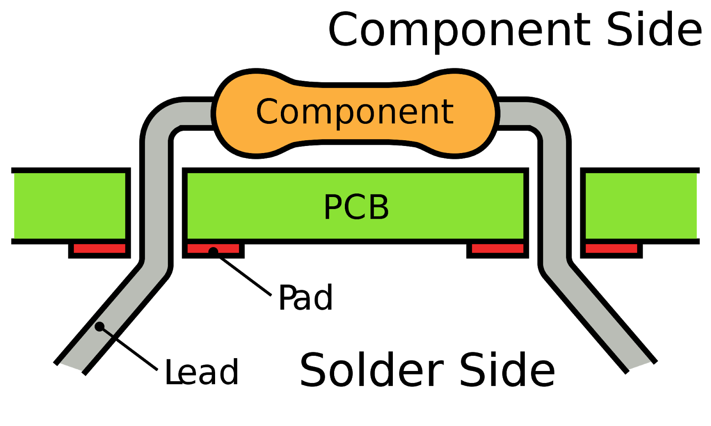
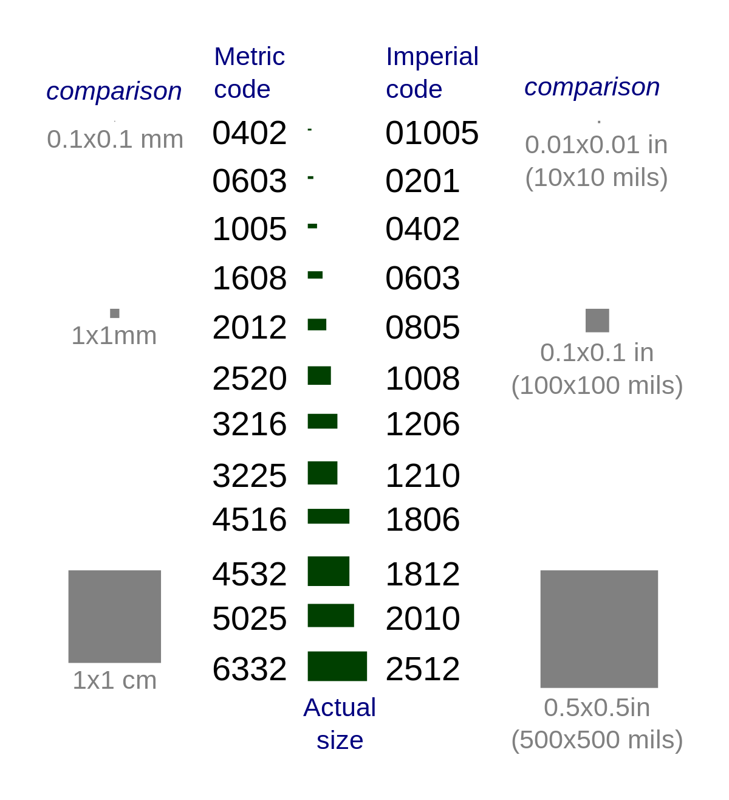

# Piscine Hardware : Creation de PCB!

## Index

## Introduction

Today, we're gonna see the basics of making a
[PCB](https://en.wikipedia.org/wiki/Printed_circuit_board)

### Design software

In order to do this, we're going to use a design software :
[Easyeda](https://easyeda.com/). It is a proprietary software that makes design
easy. There are alternative software bu Easyeda is the only one to provide a
complete environment, from the componant library to the actual purchase of the
designed board.

### PCB alternatives

Until today, you were creating your electronic circuits on breadboards, which is
practical for prototyping, but not viable for a released product aiming to be
used by other people.
There are different ways to make a time-resistant electronic circuit :

- [Perfboard](https://en.wikipedia.org/wiki/Perfboard):
  A pre-perforated board with a standard grid size (0.1 inches)
  without an electric connection between the different holes.

- [Stripboard](https://en.wikipedia.org/wiki/Stripboard):
  Quite like the perfboard, but the holes are electrically linked, the way a
  breadboard is made.

- [PCB](https://en.wikipedia.org/wiki/Printed_circuit_board):
  the most professionnal way, and the most adapted to automated production,
  Unlike the other 2 solutions, it is the only one that makes miniaturization
  possible thanks to the use of surface-mounted components.

### Les different type de composant

Most electrical components are available under different formats :

- [Through-hole](https://en.wikipedia.org/wiki/Through-hole_technology)
  Every component you might have used until now is part of this category, for
  exemple, a reistor.
  
  In order to use them the board you are using must be perforated.

- [SMD/SMT](https://en.wikipedia.org/wiki/Surface-mount_technology):
  This component category is surface-mounted : no need to drill the boards, which
  makes it possible de reduce manufacturing costs.
  Another advantage of this category is the size of the components, way smaller
  than the others. For exemple a resistor. 

## Easyeda

Design is done in 2 steps : The electrical schematics and then the routing.

## EXO 1

### PART1

For this exercise, you are gonna use an existing project and complete it to
familiarize yourself with the editor. You can find it in the ressources folder

LIEN

This project contains several buttons and leds.
You'll need to connect them in the following way :

SW1 -> D7

SW2 -> D8

LED1 -> D6

LED2 -> D5

We are gonna be using the arduino USB port for power.

you can move every component around to link them in the best possible way, think
about the recommended ways to connect them, as seen in the first pool days.

### PART 2

Now that the schematics are done, we'll get to routing.
Go to Design -> Convert schematic to PCB

A new page opens up, use the default parameters.

Create the board in such a way that the arduino board's usb port in facing the
right side and the led is on top, with the buttons underneath.

## EXO 2

### Introduction

Now that you've created your first pcb using components I pre-selected, you'll
enter the most complicated part. In a real project, you need to select
components yourself, while you'll always be guided here.

While in the first Exercise, you used an arduino board, here we're going to be
directly using the chip found in ESP 32 boards.
For the next exercises, You're going to iterate on the same design, adding
features one after the other. Here you'll be doing more work than you would have
on an actual project, since you'll be routing everything at every step, whereas
in a real project, the routing would have only be done once the design established.

You must now be wondering what you are going to make. Your goal will be to
design a universal remote to control any and all projects you'll be making in
the future.

### Part 1

The basics : For a remote, you need a controller, and we'll use an ESP32 board
here.
Any electronics component needs passive components in order to work (resistor,
capacitor, inductor etc...). All these informations are in the component's
datasheet. They are available directly on the JCLBCP website (even if you might
find yourself literally reading chinese sometimes).

Open the ESP32 datasheet and find the missing informations you need for a
functionnal ESP32 board. you'll need to add the missing components yourself from
the JLCBCP library.

    
Tips

    Let's meet again on page 19

- An esp32-s2
- A USB-C port
- A crystal (a la bonne fréquence)
- An LDO tension regulator (3.3V)
- A reset switch
- A flash switch (boot mode)
- A debug port (JTAG)
- A serial communication port (UART)
- A state led

Don't hesitate to reach out if you need help, have questions, or need to
validate your design.

### Part 2

There are no additional constraints for routing. But don't forget about the
constraints of the components you've been using so far, like the USB port and
[the WIFI](https://lewifi.fr/)

## EXO 3

### Part 1

The ESP32 basics are ready, but you'll admit that it doesn't look too much like
a remote for now. We'll fix this right now by adding some buttons.

I need you to gather at least :

- 2 2-axis analog joysticks
- 2 on/off switches
- 2 push buttons

You can add anything else you want, but don't waste too much time

### Part 2

Your PCB must be shaped like a video game controller, and the switches must be
placed in a way that makes sense on a controller.

## EXO 4

Now you're going to add other chips :

- NRF24L01P-R: a radio transceiver (C8791)
- MMA8653FCR1: a gyroscope (C132231)
- TF-01A: an sd-card reader (C91145)

Don't forget to check out these component's datasheets to understand how to
connect them to the ESP

### EXO 5

We'll be adding an OLED display (C90547), to display all sorts of information
and configuration. But a screen means another control system :
5 switches laid out in D-pad fashion should do it.

Don't forget to update the routing with these new components.

### EXO 6

Up to this point, your remote needed to be plugged-in to work, not very
practical. Here's a solution : add a battery !

Don't forget to add a tension regulator, a charging system and a level indicator

### EXO 7

How about going farther ?

#### .1

You're right, holding a naked pcb isn't the most ergonomic thing. What if you
used what you learned earlier today in this project ?
I'm asking you to create a 3D model of a case for your remote.

#### .2

In the beginning, I made you use an ESP32-S2. This microcontroller has a few
advantages : it carries wifi and bluetooth, but it also has a complete 2.0
interface, which means that you can write a driver to make it usable with a
computer to make it either a game controller or a ground station to display more
information about the devices it is connected to. Wifi and Bluetooth could be
useful to you here.

## Conclusion

Congratulations ! You made your very own PCB. You can even order your first
creation directly from your schematics. But be careful, there might still be
mistakes in your work, and soldering the components yourself might be a tough
task.

If you want to see what these exercises could have looked like, you can always
check out my own version.
