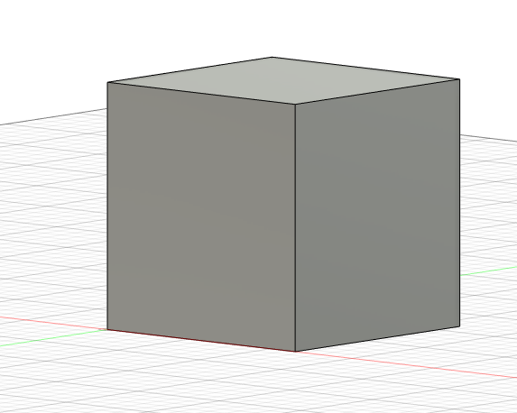
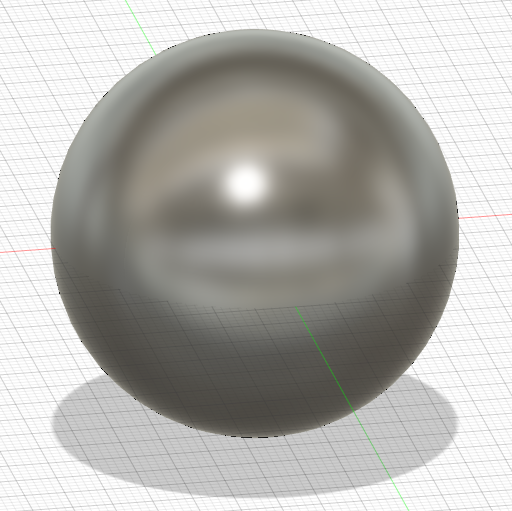
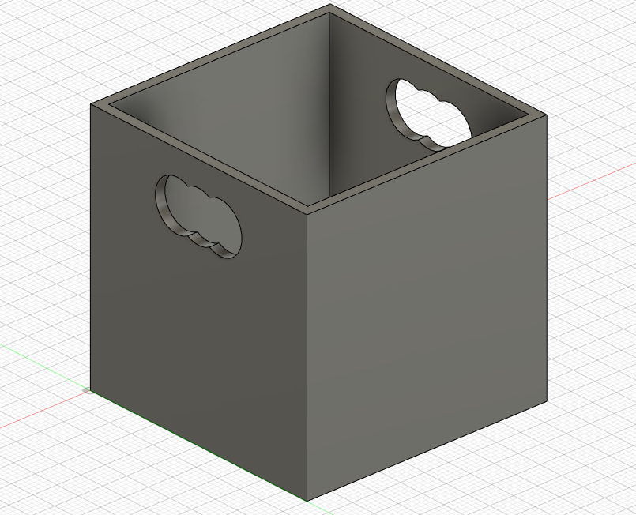
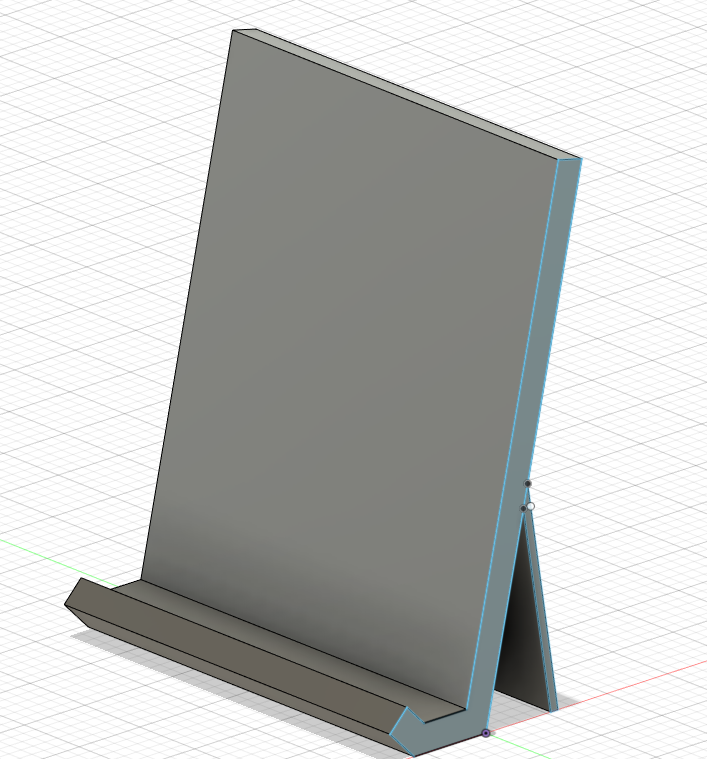
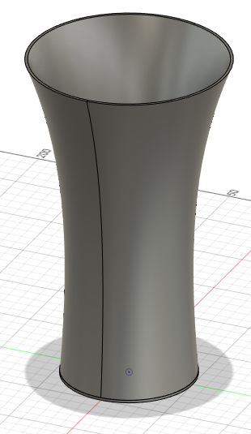
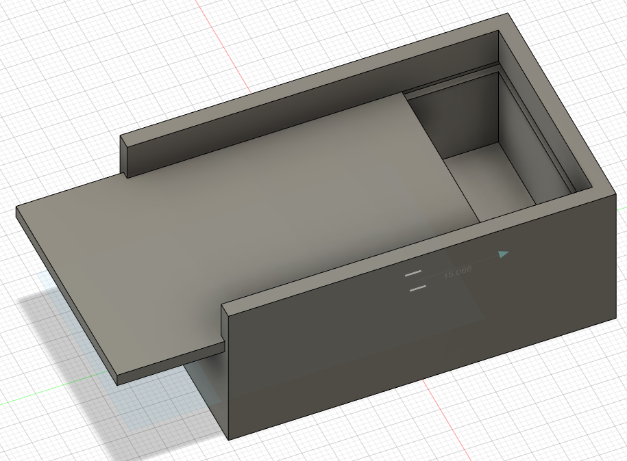
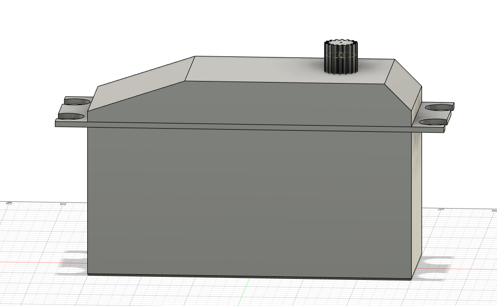

# Piscine Hardware : Journée Modélisation 3D !

## exercice 1: Les bases
 Faire un cube de 57.58mm d'arête (Attention, on viendra vérifier la taille !).

Faire une sphère.

## Exercice 2: Un peu plus technique

Faire une boite avec des poignées.

Faire un stand de téléphone.

Faire un vase.

## Exercice 3: Le mouvement 

Faire une boite avec un couvercle coulissant.

## Exercice 4: Plus vrai que nature
Faire un servomoteur simplifié.

## Exercice 5: 

> Pour cet exercice, vous allez pouvoir modéliser une voiture, une fusée, ou même une montre à gousset si ça vous chante. Le principal, c'est qu'il faut que ce soit imprimable et **sous** 10cm³ pour que vous puissiez repartir avec !
