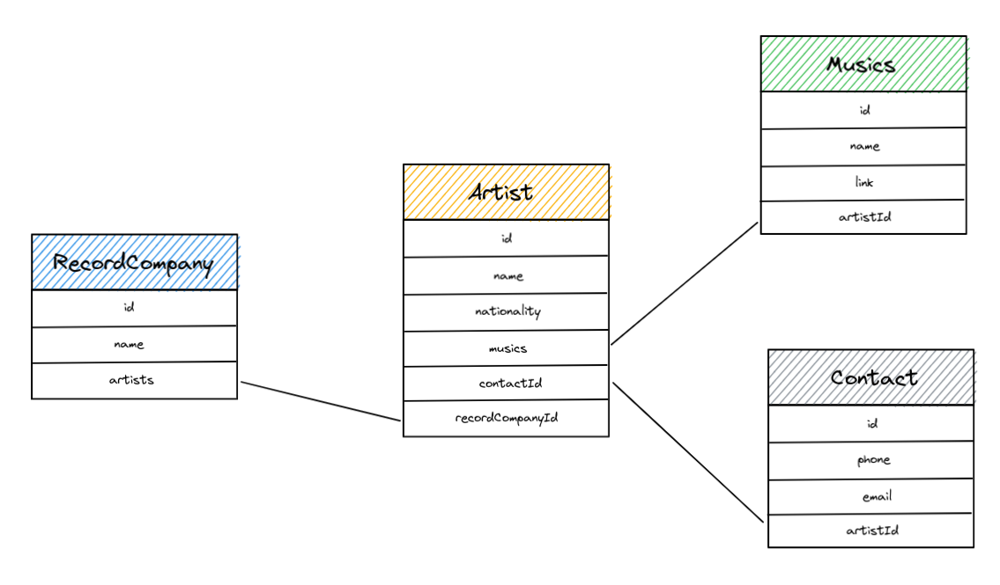
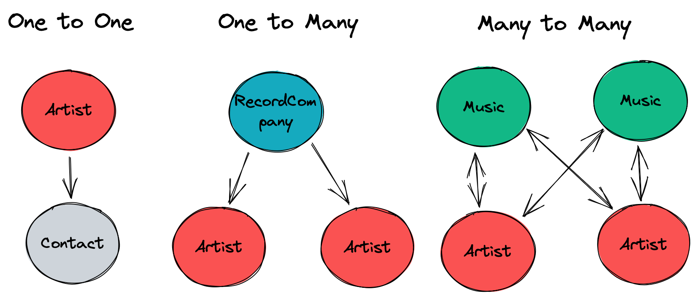

# PoC Software Pool 2022 - Day 02 - ORM

**Day purposes**

:heavy_check_mark: Discover ORM.

:heavy_check_mark: Execute SQL query directly from code.

:heavy_check_mark: Understand ORM pro and cons.

## Introduction

This morning, you wrote raw SQL queries to manage resources in a database.<br>
Indeed, you can also do it directly from your code with a [client](https://www.npmjs.com/package/ts-postgres).
It's an efficient way but what if you have a big database with many relations
and tables? It will be hard to correctly maintain your code and follow update
in your database. What will happen if you miss an update and broke your database?
How will you manage [data migration](https://www.postgresql.org/docs/current/app-pgdump.html)?

There are many disadvantage to manually manage your database, and it's not
relevant in small project. As well, you must learn the query langage and 
specifies of the used database.

To solve this problem, you can use an [ORM](https://en.wikipedia.org/wiki/Object–relational_mapping).
It stands for *Object Relational Mapping* and help you to code faster, better and
automatically synchronize your codebase with your database.<br>
More than that, your database can be directly define from your code or from a schema. You don't have to learn a query langage and some ORM can
handle multiple database.<br>
The last killer feature of ORM is the code generation, you can generate all
basics functions (CRUD for instance) and call it from your code.

:warning: Even if ORM are perfect for small or simple projects, it will always
be better to use raw SQL for a production application. If you require 
performance and control, manage your database manually or tools that still
give you control on your code.

## Step 0 - Setup

- In the `day02` folder in your pool directory, create a folder `ORM`.

```shell
mkdir -p day02/ORM
```

We will go back to Typescript so let's initialize a new NodeJS project

```shell
npm init
```

You can now add Typescript and ESLint/Prettier using knowledge from [day01](../../../day01/Typescript).

> :bulb: Don't hesitate to go back to previous step if you need it.

## Step 1 - Put the base

The purpose is to create and work with a PostgreSQL database that contains those resources :
- `RecordCompany`
- `Artist`
- `Contact`
- `Music`

Here's a schema to clear your mind :



It's similar to the one from the [SQL subject](../../1%20-%20SQL), but this time
you will create it yourself.

To be more precise, you will define a schema and your ORM will create it for
you using raw SQL queries.

To do that, we will use [Prisma](https://www.prisma.io)! It's a powerful ORM that supports resource
definition outside code. It follows a schema and generate both code and SQL query
for you.<br>
With Prisma, a [schema](https://www.prisma.io/docs/concepts/components/prisma-schema) 
is a database and a [model](https://www.prisma.io/docs/concepts/components/prisma-schema/data-model#defining-models) is a table.

> You should look at the [Prisma documentation](https://www.prisma.io/docs/).

### Installation

Let's install prisma binary in our project

```shell
npm install --save-dev prisma
```

We can now initialize prisma

```shell
npx prisma init
```

> `npx` is a tool to execute binary installed locally in a NodeJS project.

You should see a new folder `prisma` in your current directory.

### Schema

To begin, we will create only one table.

In the file `prisma/schema.prisma`, create a new model `Artist` with the
following properties :
- `id`: the unique key of your model, it must be a string [automatically generated as uuid](https://www.prisma.io/docs/concepts/components/prisma-schema/data-model#defining-a-default-value).
- `name`: Artist's name
- `nationality`: Artist's nationality

> It's really important to define a key `id` when you create a resource, this
> way you can distinguish two resource with the same data but not the same 
> identifier. Indeed, you can use a simple number and increment it, but
> it's safer to use an `uuid`.

For now, nothing is concrete, continue to step 2 to execute your first
query directly from Typescript.

## Step 2 - Things get serious

You defined your database but there is no running database at this moment.
We are now using an ORM so everything will be manage by it, we just need to
give it a connection URL.<br>
The purpose is to create a database, migrate our schema in and setup a client.

We will use a [PostgreSQL](https://www.postgresql.org) database
because it's efficient and one of the most used database across the world.

To easily start it, we will use the [official docker image](https://hub.docker.com/_/postgres).

### Configuration

First, we must configure our environment to give prisma access to our
future database. To centralize our configuration, we will use the `.env`
file. This way we will be able to use those value from our host and keep
only one source of truth.

Update the `.env` file with the following variables :
- `DB_USER`: Database username
- `DB_PASSWORD`: Database user password
- `DB_HOST`: Host location (here it's `localhost`)
- `DB_PORT`: Listening port of your PostgreSQL server, by default it's `5432`
- `DB_NAME`: Name of your database
- `DB_URL`: Connection url, it's composed of all information defined before.
Set it to : `postgresql://$DB_USER:$DB_PASS@$DB_HOST:$DB_PORT/$DB_NAME)`

> You can create multiple database in a single PostgreSQL server, so it's
> important to specify a name.

### Start database

Our environment is ready, let's create a postgres database.

To make it easier to start for everybody, we will directly add the setup
command in our `package.json`. This way, you can run the database without
effort.

> It's common to add external dependencies' setup directly into the 
> `package.json`.

Add the following `script` to your `package.json` : 

```json
"dev:db": "docker run --name ${DB_NAME} -e POSTGRES_PASSWORD=${DB_PASS} -e POSTGRES_USER=${DB_USER} -e POSTGRES_DB=${DB_NAME} -p ${DB_PORT}:${DB_PORT} -d postgres:alpine",
```

You can now start the database 

```shell
# Add variable to your environment
source .env

# Start database
npm run dev:db
```

You can verify that your database is successfully started with `docker container ls`.

### Migrate schema

We will now ask prisma to generate the database from our schema

```shell
# Migrate data
npx prisma db push
```

> You can also generate schema from a database using the [introspection](https://www.prisma.io/docs/getting-started/setup-prisma/add-to-existing-project/relational-databases/introspection-typescript-postgres).

You can verify with [Datagrip](https://www.jetbrains.com/datagrip/) that
your database has been successfully created.

### Client

Let's install the [Prisma client](https://www.prisma.io/docs/getting-started/setup-prisma/add-to-existing-project/relational-databases/install-prisma-client-typescript-postgres) in our dependencies 

```shell
npm install @prisma/client
```

Let's generate the code from the schema

```shell
npx prisma generate
```

### Code

Finally, we can start coding.

Create a folder `src` and a file `index.ts`.

Copy the following code :

```ts
// Import Prisma Client constructor
import { PrismaClient } from '@prisma/client';

// Constructor client
const prisma = new PrismaClient();

// Declare asynchronuous main
async function main() {
    console.log(`Database connected`);
};

// Run main
main()
  .catch((e) => {
	// Throw on error	
    throw `Failed to initialize database: ${e}`;
  })
  .finally(async () => {
	// Disconnect client after main
    await prisma.$disconnect();
  })
```

You can now run add a `start` script into your `package.json` and run
`npm run start` to launch it.

If everything goes well, you should see the message `Database connected` in
your terminal.

## Step 3 - CRUD with an ORM

As usual, a resource must expose a CRUD interface to be manipulated.

Let's write function to read, create, update and delete an `Artists`.

You will create a directory `src/models` and code all your functions in the
file `artists.ts`.

To do this, you will need to create a file `client.ts` in your directory
`src` that will create a `Prisma Client` and export it.

> You can copy the logic of the step 2.

You can now import the client to call [CRUD function](https://www.prisma.io/docs/concepts/components/prisma-client/crud)
generated by prisma.

> :warning: Don't forget that manipulation in your database takes time, so your
> function must be *asynchrone*.

### C for Create

Create an _asynchronous_ function named `createArtist`.

It must take as parameters :
- `data`: an object that contains all artist's properties (`name` and `nationality`)

The function must create a new `Artist` in the database and return it.

### R for Read

Create an _asynchronous_ function named `getArtists` that will return all
`Artists` stored in your database.

Create an _asynchronous_ function named `getArtist`.

It must take as parameter an `id` of type `string` and return it if you
find an `Artist` with this id.

### U for Update

Create an _asynchronous_ function named `updateArtist`.

It must take as parameters :
- `id`: artist's identifier
- `data`: information to update

This function must update artist's data, save it in the database and return it.

> :warning: It must be possible to give any properties supported by Artist.

Example

```ts
updateArtist(id, { name: 'newName' }); // Works
updateArtist(id, { name: 'newName', nationality: 'French' }); // Works
updateArtist(id, { name: 'newName', unknowProperty: 'Unknown' }); // Error
```

> You should have a look to the [Partial keyword](https://www.typescriptlang.org/docs/handbook/utility-types.html).

### D for Delete

Create an _asynchronous_ function named `deleteArtist`.

It must take as parameter an `id` of type `string` and delete it.

> :bulb: Find more information about CRUD [here](https://en.wikipedia.org/wiki/Create,_read,_update_and_delete).

## Step 4 - CRUD testing

Tests are important, even more when it's about resource manipulation. 
If something is broken in it, your whole application will be broken.

To do so, you will set up a Jest testing suite. 
You can check [day01](../../../day01/Typescript) if you don't remember the setup.

You can now write tests for each CRUD functions:
- `createArtist`
- `getArtists`
- `getArtist`
- `updateArtist`
- `deleteArtist`

## Step 5 - Contact Artists

If you correctly remember the step 1, our database is composed of 4 tables :
`Artist`, `Contact`, `Music` and `RecordCompany`. To simplify the work,
we code our project step by step.

Let's add the table `Contact` in our schema and our first relation.

In relational database, there are 3 types of relationship :
- `One to One`: one entity is link to another.<br>
For example, an `Artist` can have only one `Contact`.
- `One to Many`: also called `Many to One`, it's an entity that can be linked to
more than one kind of another entity.<br>
For example, a `RecordCompany` can works with many `Artist` but an `Artist` can
only have one `RecordCompany`.
- `Many to Many`: Many entities from a table are linked to many entities from
another table.<br>
For example an `Artist` can sing multiple `Music` and a `Music` can be singed
by multiple `Artist`

Here's below a schema to illustrate those relationships



> Click [here](https://www.prisma.io/docs/concepts/components/prisma-schema/relations)
> for more information about Prisma relationship.

If you have well followed those explanations, you can figure out that we
will create a `One to One` relationship.

### Schema

Let's first update our [Prisma schema](https://www.prisma.io/docs/concepts/components/prisma-schema) with
the new model `Contact`.

It must be composed of the following properties :
- `id`: unique identifier automatically generated (same as `Artist`)
- `email`: Artist's email (`string`)
- `phone`: Artist's phone (`string`)
- `spotify`: Artist's Spotify link (`string`)
- `youtube`: Artist YouTube channel's link (`string`)

You will also need to create the relation between `Artist` and `Contact`.

To do so, update your models to :
- Link `Artist` to `Contact`
- Declare the [`One To One`](https://www.prisma.io/docs/concepts/components/prisma-schema/relations/one-to-one-relations)
relation between them
- Add a [cascade](https://www.prisma.io/docs/concepts/components/prisma-schema/relations/referential-actions#cascade) behavior on deletion and update. 

> :warning: If an `Artist` is deleted, his `Contact` must follow. This is what
> we called cascade.

You can apply your change using

```shell
npx prisma db push
```

> If you encountered an error, your schema is certainly false.

### The return of CRUD

Let's add the model functions to interact with. Still in `src/models`,
create the  file `contact.ts`.

You should have understood the concept, explanation will be brief.

#### C for Create

Create an _asynchronous_ function `addContact`.

It must take as parameters :
- `artistId`: Artist's identifier to link with
- `data`: Contact's properties (`email`, `phone`, `spotify`, `youtube`)

This function must create a `Contact and [connect](https://www.prisma.io/docs/concepts/components/prisma-client/relation-queries#connect-an-existing-record)
it to the selected `Artist` and return it.<br>
If the artist do not exist, it must return an error.

#### U for Update


Create an _asynchronous_ function `updateContact`.

It must take as parameters :
- `id`: Contact's identifier to update
- `data`: Contact's properties to update (`email`, `phone`, `spotify`, `youtube`)

This function must update the `Contact` with given data and return it.<br>
If the contact do not exist, it must return an error.

> Same as `updateArtist`, `data` can contain any properties of `Contact` so
> you will also need to use [Partial](https://www.typescriptlang.org/docs/handbook/utility-types.html).

#### D for Delete

Create an _asynchronous_ function `deleteContact`.

It must take as parameter the `id` of the `Contact` to remove and delete it.<br>
Indeed, return an error if the `Contact` do not exist.

#### R for Read

It's not relevant to retrieve a `Contact` without his `Artist`.

Instead of create `getContacts` and `getContact`, you will update **all**
`Artist` model functions to [include](https://www.prisma.io/docs/concepts/components/prisma-client/relation-queries#include-all-fields-for-a-specific-relation)
`Contact` in his result.

#### T for Test

As usual, test your functions to verify their behavior.

## Step 6 - Skilled artists

We added the first relation of our `Artist`, let's add the second with `RecordCompany`.

This time, it will be a [One to Many](https://www.prisma.io/docs/concepts/components/prisma-schema/relations/one-to-many-relations) 
relationship.

### Schema

Update your [Prisma schema](https://www.prisma.io/docs/concepts/components/prisma-schema)
to add the model `RecordCompany` with the following properties :
- `id`: same as usual, you are a professional now
- `name`: Record's name
- `artists`: List of `Artist` working with this `Record`

You can now link them in a [`One To Many`](https://www.prisma.io/docs/concepts/components/prisma-schema/relations/one-to-many-relations)
relation.

### CRUD (again)

You are now used to this, create a file `recordCompany.ts` in `src/models`.

#### R for Read

Create an _asynchronous_ function `getRecordCompanies` that will return
all `RecordCompany` stored in the database.

Create an _asynchronous_ function `getRecordCompany`.

It must take as parameter an `id` and return a `RecordCompany` if one match.

#### C for Create

Create an _asynchronous_ function `createRecordCompany`.

It must take as parameters :
- `data`: an object that contains record company's properties (`name`)

The function must create a new `RecordCompany` in the database and return it.

#### U for Update

Create an _asynchronous_ function `updateRecordCompany`.

It must take as parameters :
- `id`: record company's identifier
- `data`: an object that contains record company's properties to update (`name`)

The function must update the `RecordCompany` in the database and return it.<br>
If the `RecordCompany` do not exist, return an error.

#### D for Delete

Create an _asynchronous_ function `deleteRecordCompany`.

It must take as parameters :
- `id`: record company's identifier

The function must delete the `RecordCompany` in the database.<br>
If the `RecordCompany` do not exist, return an error.

### Link our entities

Since `RecordCompany` and `Artist` are standalone entities, it will be
necessary to create function to link/unlink an `Artist` to a `RecordCompany`.

Still in `src/models/recordCompany.ts`, we will add 2 new functions.

#### Link

Create a function `addArtistToRecordCompany`.

It must take as parameters :
- `artistId`: Artist's identifier
- `recordCompanyId`: Record company's identifier

Your function will [connect](https://www.prisma.io/docs/reference/api-reference/prisma-client-reference#connect)
those entities following their id.<br>
Indeed, if one of them do not exist, return an error.

#### Unlink

Create a function `removeArtistFromRecordCompany`.

It must take as parameters :
- `artistId`: Artist's identifier
- `recordCompanyId`: Record company's identifier

Your function will [disconnect](https://www.prisma.io/docs/reference/api-reference/prisma-client-reference#disconnect)
those entities following their id.<br>
Indeed, if one of them do not exist, return an error.

### Test

You are used to it, write Jest test to verify that everything work well :rocket:

## Step 7 - Active artists

Finally, we are near the end! Only one entity remains : `Music`.

This step is intentionally less guided, if you reached it, you should
have understood everything about relational database, crud and how you should
code it.

### Schema

Update your schema with the model `Music`. It will be composed of the following
properties :
- `id`: unique identifier
- `name`: music's name
- `link`: public link to the music (it could be whatever you want _YouTube_, _Spotify_...)
- `artistsId`: `Artist` owner
- `artists`: `Artist` in featuring

You will need to create a [`Many To Many`](https://www.prisma.io/docs/concepts/components/prisma-schema/relations/many-to-many-relations)
relation between `Artist` and `Music`.

> Don't forget to update other models if it's necessary.

### You already know it

You already know what to do and how to do, so do it! :rocket:

We want to :
- create
- read
- update
- delete
- link an artist to a music
- remove an artist from a music

Indeed, don't forget to handle errors and write test.

## Bonus

Yesterday, you coded a cool application following a strong and resilient architecture
called MVC.

An advantage of MVC is his layered architecture, you can easily update a
part of your application without refactor everything.

If you remembered well, your data storage was a simple `JSON` file, what
about replacing it if a relational database?

You know how MVC works, you know how store data in relational database, you
know an easy way to interact with database directly from your code.

Let's mix all your knowledge to add a permanent storage to your application.

Indeed, you are free to add/update models, refactor the application and
do whatever you find useful and fun.

Have fun!

## To go further

Some link to additional resources and cool stuff

- [Visualize your data with Prisma studio](https://www.prisma.io/studio)
- [A classes based ORM : TypeORM](https://typeorm.io/#/)
- [ORM vs raw SQL](https://levelup.gitconnected.com/raw-sql-vs-query-builder-vs-orm-eee72dbdd275)
- [Prisma Blog](https://www.prisma.io/blog/)
- [Comparing Prisma](https://www.prisma.io/docs/concepts/more/comparisons)

> Made with :heart: by PoC
