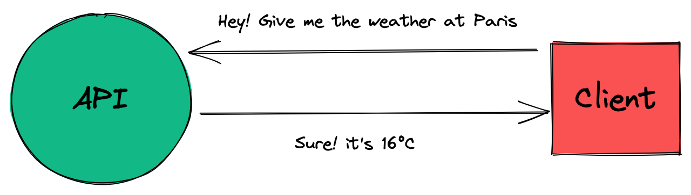

# PoC Software Pool 2022 - Day 03 - REST API

**Day purposes**

:heavy_check_mark: Discover HTTP server with express.

:heavy_check_mark: Learn basics and good practises of web development.

:heavy_check_mark: Secure your endpoints with validators.

:heavy_check_mark: Explore request's resources, their location and usage.

## Introduction

In our modern world, **everything** is a story of [server](https://developer.mozilla.org/en-US/docs/Learn/Common_questions/What_is_a_web_server).

If you want to share a resource on the internet you will need a server. You
want to save your picture into a cloud? Same. You want to access PoC's amazing
subject? Everything is on GitHub and by extension, on their servers.

They have many usages and everyone uses it daily. One of the most common is
the resource sharing. With server and a protocol, you can share resource between application or clients.

Those kinds of application are called [API](https://www.redhat.com/en/topics/api/what-are-application-programming-interfaces),
it's an interface exposed to let your application share resources with other application
or consumers. For example, you can ask for the weather through a [weather API](https://www.weatherapi.com).

To communicate, APIs follow the [HTTP protocol](https://en.wikipedia.org/wiki/Hypertext_Transfer_Protocol)
and standard. The most popular is [REST](https://en.wikipedia.org/wiki/Representational_state_transfer).

Below a simple schema of an API and a client.



This subject will give you all knowledge required to create a secure REST API.

## Step 0 - Setup

Still in your repository, create a new directory for the `day03`

```shell
mkdir -p day03
```

You can directly initialize your repository with `npm init` and `typescript`, `eslint` and `prettier`.

> See [day01](../../day01/Typescript) if you do not remember how setup a NodeJS project.

You will also need to create a `tsconfig.json` with the following configuration

```json
{
  "compilerOptions": {
    "target": "es2020",
    "module": "commonjs",
    "sourceMap": true, 
    "outDir": "./dist",  
    "strict": true,  
    "allowUnreachableCode": false,

    "baseUrl": "./src",
    "esModuleInterop": true,
    "forceConsistentCasingInFileNames": true
  },
  "include": [
    "src/**/*.ts"
  ],
  "exclude": [
    "node_modules",
    "tests/**/*.ts"
  ]
}
```

> Check the [documentation](https://www.typescriptlang.org/docs/handbook/tsconfig-json.html)
> if you are curious about TSConfig.

As usual, you can also create a folder `src`

```shell
mkdir -p src
```

## Step 1 - Hello web

Let's begin with a simple `hello world`. Indeed, it will be more complex
than a simple hello world function called from a main, but it's not that hard.

First, we must create a server using [express](https://github.com/expressjs/express)
package. It's the most popular framework to create server in NodeJS.

Let's install express and his type dependencies.

```shell
npm install express @types/express
```

Let's create a file `server.ts` to initialize our server.

In it, create a variable `server` that will instantiate your express server.

> In the [official documentation](http://expressjs.com/en/starter/hello-world.html),
> examples are in javascript, don't forget to convert it to Typescript when
> you will reproduce it.\
> For example, use `import` instead of `required`.\
> ***Please take a moment to read the documentation.***

When your `server` is correctly initialize, launch it to listen on port `8080`.

> We encourage you to display a message that display your server root
> endpoint to easily reach it.\
> For example : `server listening on http://localhost:8080/`

You must also define an endpoint `hello` reachable through the 
[method](https://developer.mozilla.org/en-US/docs/Web/HTTP/Methods) `GET`.\
When hitting the endpoint, it must respond `world` and status `200`.

> You can import types `Request` and `Response` from `express` to add
> types to your parameters in the handler of your endpoint.

## Step 2 - Where are data?

### Theory

In [HTTP](https://en.wikipedia.org/wiki/Hypertext_Transfer_Protocol),
data are stored in different part of the request depending on the data type :

- [`body`](https://en.wikipedia.org/wiki/HTTP_message_body): message in the
request. Generally used to store structured data in a given format 
(`JSON`, `XML`, ...)
- [`query`](https://en.wikipedia.org/wiki/Query_string): a string that
extends the url to fill parameter of type `key/value`. Generally used to
give additional information about the request.<br>
For example : order of data return, max number of entities etc... It also
used for [SEO](https://en.wikipedia.org/wiki/Search_engine_optimization).
- [`url param`](https://doriantaylor.com/policy/http-url-path-parameter-syntax): a dynamic
string in the path. Generally used to select a resource directly from
the url. For example: `http://localhost:3000/cat/1` select the resource `cat` with
the id `1`.
- [`cookie`](https://developer.mozilla.org/en-US/docs/Web/HTTP/Cookies): used to
store session (keep user logged in) or track user activity.
- [`header`](https://developer.mozilla.org/en-US/docs/Web/HTTP/Headers): a `key/value` stored
used for contextual information. You can specify type of your request, proxy
information, give API KEY, how server should manage cache etc...

### Installation

In this step, we will learn how extract data from those locations.

To do this, we will need to install additional dependencies :

```shell
npm install body-parser cookie-parser @types/cookie-parser
```

Those dependencies are [middlewares](https://expressjs.com/en/guide/using-middleware.html) that will help you parse data from
the [body](https://www.npmjs.com/package/body-parser) and [cookies](https://github.com/expressjs/cookie-parser).

You will need to import and apply them to your server using the `use()`
method from your `server`.

### Here we are

It's time to create your different endpoints in the file `server.ts`

#### Query

Create the endpoint `/repeat-my-query`, it must define the following handler
for the method `GET`:

If there is a message in the [query](https://www.educative.io/edpresso/what-is-reqquery-in-expressjs),
return it with status `200`.<br>
If there is no message : return `Bad Request` with status `400`.

#### Param

Create the endpoint `/repeat-my-param/:message`, it must define the following handler
for the method `GET`:

Take as [url parameter](https://www.geeksforgeeks.org/express-js-req-params-property/)
a `message` and return it with status `200`.

#### Body

Create the endpoint `/repeat-my-body`, it must define the following handler
for the method `POST`:

If there is a `message` in the [`body`](https://masteringjs.io/tutorials/express/body)
of your request, return it with status `200`.<br>
If there is no `message`, return `Bad Request` with status `400`.

#### Header

Create the endpoint `/repeat-my-header`, it must define the following handler
for the method `GET`:

If there is a [header](https://stackoverflow.com/questions/13147693/how-to-extract-request-http-headers-from-a-request-using-nodejs-connect)
`X-Message`, return his value with status `200`.<br>
If there is no header `X-Message`, return `Bad Request` with status `400`.

#### Cookie

Create the endpoint `/repeat-my-cookie`, it must define the following handler
for the method `GET`:

If there is a [cookie](https://www.geeksforgeeks.org/express-js-req-cookies-property/)
`message`, return his value with status `200`.<br>
If there is no cookie `message`, return `Bad Request` with status `400`.

> You can use [Postman](https://www.postman.com) or 
> [Insomnia](https://insomnia.rest) to test your HTTP endpoints.

> You should check [http-status-codes](https://www.npmjs.com/package/http-status-codes)
> to explicitly set your status code in your response.

## Step 3 - A scaling issue

### Theory

It's common to configure your web server when you are about to launch it.<br>
In those case, you can't just hardcode value in your code, you need another
way.

[Environment variables](https://en.wikipedia.org/wiki/Environment_variable) 
are the best way to configure a software behavior.
You can check them by tipping `env` in your terminal.

Those variables are used when you deploy an application in production to
specify some parameters that will affect the global behavior of your app.
It can also be used to pass sensitive information, API Key, secrets etc...

It's essential to know how use it! In this step, we will try to dynamically
configure your `host` and `port` when running the server, and create a 
dynamic greeting message.

As well, it's important to think about your configuration from the beginning
of your application by putting any variable that should be configurable into
your environment.

### Installation

Let's install [env-var](https://github.com/evanshortiss/env-var)
a useful dependency to automatically load environment with a defined schema.

```shell
npm i env-var
```

You will also need to install [direnv](https://direnv.net)
to load environment variable from your terminal using `direnv allow`.

> :warning: Do not forget to update your shell with the [direnv hook](https://direnv.net/docs/hook.html).

### Practice

Now you can create a file `.envrc` that will `export` the following
environment variable :
- `SERVER_PORT`: `8080`
- `SERVER_HOST`: `localhost`
- `HELLO_MESSAGE`: `world`

Let's create a file `serverConfig.ts` in the directory `src`. 

> In order to keep a clean architecture, it's common to dedicate a file 
> to your API configuration.

In it, use the function `get` from `env-var` to retrieve the three environment
variables and export them.

> The best way to retrieve the value is to create a generic function taking
> the `key` of the variable you want to retrieve. It will help you to
> do not repeat code.<br>
> Indeed, you can use other methods of the package to type your values.

Update `server.ts` to use the `host` and `port` define in your environment.<br>
If no `port` is defined, use the port `8080`.

You must also update the endpoint `GET` `/hello` to use the variable `HELLO_MESSAGE`
as response.<br>
If the value is not defined, return `No message defined` with status `404`.

If your `.envrc` contains sensitive information, **do not push it**! A good
practice is to create a file `.envrc.example` that will define the
same environment variables but without value.

## Step 4 - HTTP status

REST API return data according to customer's desire, but in case he tries to
access to data that he doesn't own, or who do not exist, the REST API will
not be able to do what he asked for.

When this happens, the REST API must explicitly send an error. To do so,
we can use [HTTP code](https://medium.com/@sahelasumi/http-status-codes-31644d99fb1)
help use understand what happened. Those codes are essentials and must be
correctly set from your REST API.

For example, a response with status `404` means that the resource has not been
found in the server, `201` stands for resource creation and `200` is used
when everything went well.

Let's create an endpoint `/health` that will always return the status `200`.<br>
If that endpoint fails when you test it, you are sure that your server is not
working. That's call a health-check!

Even if status code make sense of their own, you do not know the meaning of [every status
code](https://developer.mozilla.org/en-US/docs/Web/HTTP/Status).
<br> <!-- COMMENT: it breaks the paragraph if I don't put br in the next line -->
When the client receive response status, it's his own responsibility to properly
handle it. But it's important to explicit those statuses code in your codebase.

To do so, we will install the dependency [`http-status-code`](https://www.npmjs.com/package/http-status-codes)
to use aliases instead of the raw number. This way it will be really easy to
understand what we return in our response.

Let's install that dependency

```shell
npm i http-status-codes
```

Now, replace all raw http status by those one [exported](https://github.com/prettymuchbryce/http-status-codes)
by the dependency.

## Step 5 - Testing time

Since [day01](../../day01/Typescript), we asked you to create tests to verify
the behavior of your functions. API are not exception and there are also
tools to manage tests.

To do so, you can use [Postman](https://www.postman.com), it's a powerful 
GUI to make requests, tests suites and many other useful stuff like API 
mockup, documentation etc...

Install Postman and create a [Postman collection](https://learning.postman.com/docs/sending-requests/intro-to-collections/)
to tests every endpoint previously coded.<br>
After you create your request, you should be able to run a whole [test-suite](https://www.postman.com/use-cases/api-testing-automation/)
on your server.

You can also create an [environment](https://learning.postman.com/docs/sending-requests/managing-environments/)
to manage your configuration.

## Step 6 - Who use hard coded text ?

It's important to transform data sent to the client to make the API easier to use.<br>
With time, data took standard forms like `JSON` or `XML`. Here we will use
the most popular : [`JSON`](https://en.wikipedia.org/wiki/JSON).

Create an endpoint `/repeat-all-my-queries` in the file `server.ts` with
a handler on method `GET`.

This handler must retrieves all [query parameters](https://en.wikipedia.org/wiki/Query_string)
znd return an array of object containing the `key` and the `value` of each
query parameter.

Here's the shape of the data return

```json
[
    {
        "key": "<key of the query>",
        "value": "<value of the query>"
    }
]
```

To be Typescript compliant, you should create an [interface](https://www.typescriptlang.org/docs/handbook/interfaces.html)
to correctly type your data.<br>
As well, `req.query` is an object, so you will need to call a method
to retrieves object's keys.

## Step 7 - Some logic

In the previous step, you learnt how format data. We will increase a bit
the difficulty by working with it.

Create an endpoint `/are-these-palindromes` with a handler on method `POST`.

This endpoint must take a JSON body containing an array of string like the
one below

```json
[
    "meow",
    "lol"
]
```

And it must return an array of object containing the string and a boolean
set to `true` if the string is a [palindrome](https://en.wikipedia.org/wiki/Palindrome).

Here's an example 

```json
[
    {
        "input": "meow",
        "result": false
    },
    {
        "input": "lol",
        "result": true
    }
]
```

You will need to call [string's method](https://www.tutorialspoint.com/typescript/typescript_strings.htm)
to correctly complete this exercice.

## Step 8 - Server's bodyguard

It's important to know what kind of data are sent to your API. This will
help you to keep an API resilient and secured.

For example, if you send an empty body to the endpoint from step 7, you should
get an error. That kind of issue is not suitable in a production API.

To ensure API security, a system has been created : [`Middleware`](https://en.wikipedia.org/wiki/Middleware).

Here's a code snippet of a middleware for an express API :

```ts
/**
 * req  - Request
 * res  - Réponse
 * next - Fonction called after this middleware. It can be another middleware or the final handler.
*/
const myMiddleware = (req: Request, res: Response, next: NextFunction) => {
  // Middleware's logic
}
```

> Middleware can also be used for other purposes : logger, permissions 
> management etc...

To verify user inputs, we will use [Zod](https://github.com/colinhacks/zod) framework.<br>
Zod help you to retrieves a verified typed body in your handler.

Install Zod with the following command

```shell
npm i zod
```

To make it works, you'll need to add the following line in your `tsconfig.json`

```json
"strictNullChecks": true
```

#### Create schema

[Zod](https://github.com/colinhacks/zod) validate data using a schema. The
first step is to create a zod object `palindromeSchema` defining the shape
of the expected input.

To split our logic, we will create a dedicate file named `serverSchema.ts` in
the directory `src` to export our schema.

> Your schema also defined the final type of your data, to get it, you can
> call the function `zod.infer`. It's a powerful feature because you keep
> only one source of truth.

#### Write middleware

Let's write the middleware! Indeed, we will also put it in a dedicated file
named `serverMiddlewares.ts`.

You can now [write the middleware](https://expressjs.com/en/guide/using-middleware.html)
`verifyPalindromeMiddleware` that will verify the body of the request
sent to `/are-these-palindromes`.

If the body doesn't fit in `palindromeSchema`, return status `400` with the
message `Bad Request`.

> Don't forget to use `http-status-code` when you return the status code.

It's time to apply it to the endpoint `/are-these-palindromes`, here's
an example of a middleware called before a handler.

```ts
server.get('/my-route', myMiddleware, (req: Request, res: Response) => {...});
```

It's also possible to apply a middleware to the whole API. You just need to
call the function `use` of your express server.

Example :

```ts
server.use(myMiddleware())
```

Indeed, that has no sense here, because you have only one endpoint who must
be verified. But it can be useful to apply a logger middleware for instance.

> You can create a test case in Postman that verify the endpoint return
> `400` in case of bad body.

## Step 9 - Automatic fortress

Write middlewares is the best way to validate data sent to your handler, but
what if you have 10 endpoints to validate? You are not going to write
one middleware for each schema. It could lead to error and more than that, 
code duplication is never a good thing.

The purpose of this step is to create a generic middleware to validate
any kind of zod schema.

Let's create the function `validateMiddleware` in the file `serverMiddlewares.ts`.

It must take as parameters :
- `schema`: a zod objet to verify
- `location`: data location (body, query, ...)

This middleware must retrieve the data in the given location and verify that
it match with the `schema`.

In case of failure, it must return `400` with the reason of the error.<br>
In case of success, just call the next function.

You must replace the middleware `verifyPalindromeMiddleware` with the new
one and verify that everything works.

> If you have correctly understood the step, you will need to create a 
> function that return another function.<br>
> [Arrow functions](https://www.tutorialsteacher.com/typescript/arrow-function)
> are perfects for that use case.

Here's an example of the prototype of `validateMiddleware` with nested functions :

```ts
// Here `schema` has type `any` because there is no generic zod object type
// but you can try to define it ;)
// As well, you can create an Enum to list location.
// Don't hesistate to add a default location to make your function easier
// to use.
const validateMiddleware = (schema: any, location = Location.BODY) => {
  return (req: Request, res: Response, next: NextFunction): void => {
    // your logic goes here
  };
};
```

> Zod returns typed value, so you can replace your `req.body` to give
> typed value to other function.

> Never forget that it's important to create a middleware when you repeat an
> action several time in your endpoints. It will make the code cleaner and
> easier to read.

## Step 10 - Time to clean up

At this point, you should have many endpoints in the file `server.ts` :
- Some simply retrieves content in the request and return it
- Other analyses palindromes.

It's time to organize our endpoints into different files and import them into the server.

Create a folder `endpoints` in the directory `src`.
In it, create a file `repeat.ts` and `palindrome.ts`.

Now move your endpoint into corresponding files and [find a way](http://expressjs.com/en/guide/routing.html)
to use those endpoints in `server.ts`.

> When you have several endpoints, it can be useful to group all your
> endpoints in sub-routers and aggregate those routers in a main router 
> in a specific file.<br>
> This way, you can keep a simple and resilient architecture.

## Step 11 - Go Winston!

You now have a clean architecture, but there is something missing up...<br>
You don't know what happens in your API, which endpoints are hit and if
everything works.<br>Seeing the whole web traffic will help you to detect
issues in your API, but also attack from others.

To do so, you will set up a [logger](https://www.securitymetrics.com/blog/importance-log-management).
It's an important piece of your API, even during development than production.

Let's use [winston](https://github.com/winstonjs/winston). It's a powerful
logger easy to configure and use.

Let's install it

```shell
npm install winston
```

### Winston! Stand up!

Let's create a file `serverLogger.ts` in the directory `src`.

In it, export a [winston](https://github.com/winstonjs/winston) logger
with the following properties :
- The output format must be : `"[{timestamp}] [{severity}]": {message}`
- Logs must be written to standard output and the file `/var/log/api.log`
- Logs written in standard output must be colored

Winston works with [transport system](https://github.com/winstonjs/winston/blob/2.4.0/docs/transports.md),
this way you can use multiple transport at the same time.<br>
It also sorts logs following a [severity system](https://github.com/winstonjs/winston/tree/2.x#logging-levels).

> A good practice consist of saving errors logs in a file `/var/log/error.log`
> to easily find issues.

> For a better code readability, you can create an [Enum](https://www.typescriptlang.org/docs/handbook/enums.html)
> to define `severity` stages.

You can verify that everything works by replacing your `console.log` with
a `info` log.

### Winston! Line up!

One last thing remains to have a perfect API: a logger to display all
inbound requests and responses.

Create a new middleware `logMiddleware` in the file `serverMiddlewares.ts`.

This middleware must :
- Display inbound requests with the message :
`request [{request_id}] on {method} [{path}] from ({user_ip})`
- Display responses with the message :
`request [{request_id}] response in {elapsed_time}ms with status {response status code}`

You can create unique identifier with the dependency [uuid](https://www.npmjs.com/package/uuid).

> To log response, you will need to do a little hack with [events](https://nodejs.org/api/http.html).

Apply your middleware to your API and verify that everything works by sending
requests.

## Bonus

If you are still looking for exercices, here's four intermediate exercises.

### Expose data

Yesterday you've learn to manipulate a database with Prisma. Today, you've learn to build an API with Express.

What about mixing it ?

Expose yesterday's database with today's API.

### 404, Found

As this point, when a request is sent to your server on a route that doesn't
exist, you return the message `404 not found`.

It would be better to send a response that will really help the user.

To do so, you can create a middleware that will return the following message
when a request is sent to a non-existant endpoint :

```json
{
  "message": "${endpointURL} not found",
  "status": 404,
  "availableEndpoints": [
    "/hello",
    "/repeat-my-query",
    "<Other available endpoints>"
  ]
}
```

### Code readability is the key

Step 4 was about explicit status code return in our API. Let's do
this with errors return.

At this moment, they should be like this

```ts
res.status(httpStatus.BAD_REQUEST).send(content);
```

Let's make it simpler, find a way to get the following result

```ts
throw new BadRequestError(context);
```

> You can write a class for each type of error.

To do this, you will need to use [inheritance](https://www.tutorialspoint.com/typescript/typescript_classes.htm)
on class [Error](https://newbedev.com/typescript-extending-error-class) to extends it.

What you must do is :
- Create a `class` that extends class `Error`
- Create one `class` for each custom error

Then you will need a special middleware to handle thrown errors.

> You are free to do it on your own way, it's a bonus.

### Testing time, round 2

Postman is a powerful tool, but it's an external tool... you need a team
who knows the tool and everything relate to it. As well, it's hard to
create complexe pipeline with Postman, scripts work good, but it does not
feel natural compared to code.

There are frameworks specialised in tests with code, with those, it
becomes really easy to test the business logic of our projects.

Let's write test suite with the most popular :  [`Jest`](https://jestjs.io).

Setup Jest on your project and create a directory `tests` with a file `server.tests.ts`.

> You can reuse setup from the [day01](../../day01/Typescript).

You will also need to install a http client to make your request.
Let's install [axios](https://github.com/axios/axios) because it's more
powerful than a simple fetch.

Let's create a class `Requester` that will wrap a `axios` client and
contains methods to interact with the API.

> That kind of class are called [SDK](https://www.redhat.com/en/topics/cloud-native-apps/what-is-SDK).

You can now write a tests suite for each endpoint to verify that it correctly
handles errors and works well.

## Additional resources

- [API standard documentation : OpenAPI](https://www.openapis.org)
- [GUI to write API documentation](https://stoplight.io)
- [Swagger](https://swagger.io)
- [Generate your boilerplate with NestJS](https://nestjs.com)
- [Handle async operation in an express server](https://github.com/tranvansang/middleware-async)
- [Insomnia, a streamlined Postman](https://insomnia.rest)
- [NodeJS server frameworks](https://nodesource.com/blog/Express-Koa-Hapi)
- [Centralized your error handling](https://dev.to/nedsoft/central-error-handling-in-express-3aej)
