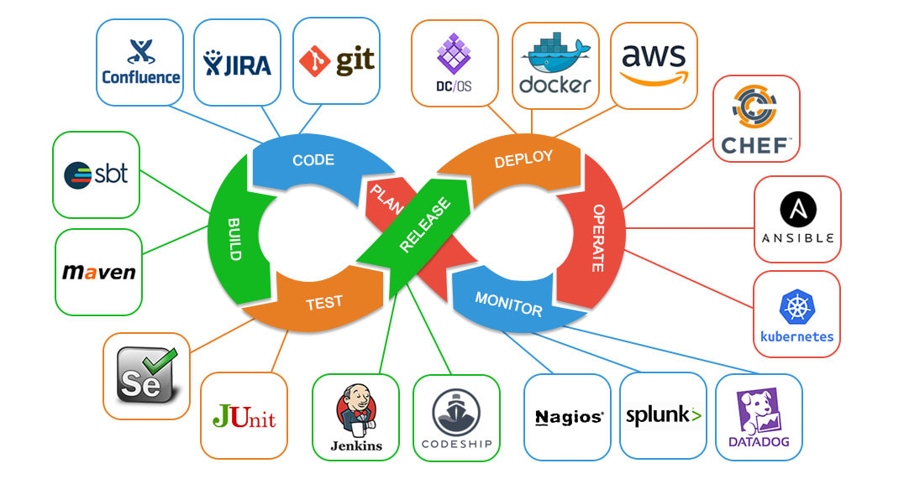

# PoC Software Pool 2022 - Day 04 - Docker

**Day purposes**

:heavy_check_mark: Understand devOps interests.

:heavy_check_mark: Learn basics of Docker.

:heavy_check_mark: Create simple image.

:heavy_check_mark: Deploy a complete stack with docker-compose.

## Introduction

When it's time to deploy an application, you will face various problems :
- How scale on various servers?
- How build your app for several architectures?
- How manage dependencies and linked services that work with your app?

For instance, if you want to deploy a simple application composed of a web 
server, a frontend and a database, you will need to install all the
required dependencies in the server, maybe update root config and create
system service to automatically restart it on fail, manage volumes and so on...

You've understood it, manually manage a stack is complex and painful.<br>
This is why Docker exist, with it, you can easily package your application
into containers and manage independently or together the containers.

This dynamic follows the way of [DevOps](https://aws.amazon.com/devops/what-is-devops/),
it's a philosophy and set of practices to improve the delivery process from
build to release and monitoring.

Here's a simple schema of the devops workflow



This subject is focus on docker and containers building & management. It's
on one the most important part of the devops.

## Step 0 - Setup

Let's install [Docker](https://docs.docker.com/engine/install/fedora/)
engine with his CLI and [docker-compose](https://docs.docker.com/compose/install/).

### Installation

> :warning: The following steps are made for fedora (your default dump). <br>
> If you use another OS, please, follow this [documentation](https://docs.docker.com/engine/install/)

#### Clean up

Let's start by removing old unused dependencies

```shell
sudo dnf remove docker                   \
                docker-client            \
                docker-client-latest     \
                docker-common            \
                docker-latest            \
                docker-latest-logrotate  \
                docker-logrotate         \
                docker-selinux           \
                docker-engine-selinux    \
                docker-engine
```

#### Installation

We can now install docker engine and docker-compose

```shell
# Add docker repository to your package manager
sudo dnf -y install dnf-plugins-core
sudo dnf config-manager --add-repo https://download.docker.com/linux/fedora/docker-ce.repo

# Install Docker
sudo dnf install docker-ce docker-ce-cli containerd.io

# Install docker-compose
sudo curl -L "https://github.com/docker/compose/releases/download/1.25.5/docker-compose-$(uname -s)-$(uname -m)" -o /usr/local/bin/docker-compose
sudo chmod +x /usr/local/bin/docker-compose
```

### Start Docker

After installing all dependencies, start docker engine:

```shell
# Start docker service
sudo systemctl start docker

# Automatically start it when computer start
sudo systemctl enable docker

# Add current user to docker group to use docker CLI without sudo
sudo groupadd docker
sudo usermod -aG docker $USER

# Logout from your user session or restart your computer
```

#### Troubleshooting

If you are on Fedora 31+, you will certainly meet this issue:

```shell
docker: Error response from daemon: cgroups: cannot found cgroup mount destination: unknown.
```

If that happens, read this [issue](https://github.com/docker/for-linux/issues/219)
and try fixes in it.

### Hello Docker

You can verify that everything goes well by running a [`hello-world`]()
container.

You should have the following output

```shell
docker run hello-world
# Unable to find image 'hello-world:latest' locally
# latest: Pulling from library/hello-world
# 93288797bd35: Pull complete 
# Digest: sha256:975f4b14f326b05db86e16de00144f9c12257553bba9484fed41f9b6f2257800
# Status: Downloaded newer image for hello-world:latest
# 
# Hello from Docker!
# This message shows that your installation appears to be working correctly.
# 
# To generate this message, Docker took the following steps:
#  1. The Docker client contacted the Docker daemon.
#  2. The Docker daemon pulled the "hello-world" image from the Docker Hub.
#     (arm64v8)
#  3. The Docker daemon created a new container from that image which runs the
#     executable that produces the output you are currently reading.
#  4. The Docker daemon streamed that output to the Docker client, which sent it
#     to your terminal.
# 
# To try something more ambitious, you can run an Ubuntu container with:
#  $ docker run -it ubuntu bash
# 
# Share images, automate workflows, and more with a free Docker ID:
#  https://hub.docker.com/
# 
# For more examples and ideas, visit:
#  https://docs.docker.com/get-started/
```

## Step 01 - Dockerfile

Dockerfile is the first piece to containerize your application.<br>
The purpose is to create an image of your application to make it easily
deployable.

This will help you to do not install the application directly on the
computer nor having dependencies issues.<br>
With an image, you can not have any problem, it's self deployable and
everything is already installed in it, you just have to run it with
`docker run <image>`.

Let's create an image of the API you made yesterday.

First, in your pool repository, in the folder `day04`, create a folder `docker`.

```shell
mkdir -p day04/docker
```

Now you can create a directory `exo01`, copy-paste yesterday API
sources and create a file [`Dockerfile`](https://docs.docker.com/engine/reference/builder/).

Your `Dockerfile` must execute the following set :
- Pull the latest [`alpine`](https://nickjanetakis.com/blog/the-3-biggest-wins-when-using-alpine-as-a-base-docker-image)
image of your language.
- [Expose](https://docs.docker.com/engine/reference/builder/#expose) port 8080
- Install dependencies
- Set the [environment variable](https://docs.docker.com/engine/reference/builder/#env)
`HELLO_MESSAGE` to `docker`
- Build the API
- Set the entrypoint to start the server when running image.

> :warning: Be careful to the listening API host.

> Take a look at those [good practises](https://docs.docker.com/develop/develop-images/dockerfile_best-practices/).

## Step 02 - Docker-compose

In the previous step, you saw how to put your application in a container,
it's time to go further : you will manage multiple containers with
[docker-compose](https://docs.docker.com/compose/).

Create a directory `exo02`

```shell
mkdir -p exo02
```

The purpose is to manage a fullstack application within container.<br>
This [application](./resources)
is composed of :
- a [PostgreSQL database](https://www.postgresql.org) (to run in a container)
- a [NestJS](https://nestjs.com) API
- a [React](https://reactjs.org) web application

Here's a simple schema of the application architecture


### Put bases

In the directory `exo02`, copy the [frontend](./resources/frontend.zip)
and [backend](./resources/backend.zip) zips and extract them.

You should have the following architecture :

```shell
tree -d
# .
# ├── backend
# │   ├── src
# │   │   └── notes
# │   └── test
# └── frontend
#     ├── public
#     └── src
#         ├── components
#         │   ├── List
#         │   ├── Task
#         │   └── TaskForm
#         ├── dto
#         └── services
#
# 13 directories
```

### Dockerfiles

As you may notice, there is no `Dockerfile` in `frontend` or `backend`.<br>
You figured out, you will need to create image for the `frontend` and the `backend`.<br>
In each directory, create a `Dockerfile` and write a set of instructions to
make it works.

> You will need to test and understand how each program work to containerize it.<br>
> Google is also your best friend, as a devOps engineer, it's common to
> work on multiple stack without necessarily being an expert on them.

### Compose

The [docker-compose](https://docs.docker.com/compose/compose-file/) aim to
orchestrate services. It will help you a lot when you need to deploy
multiple microservice.

Your docker-compose must be composed of :

3 services :
- backend: run `backend` image
- frontend: run `frontend` image
- database: run `postgres` image

1 network :
- backend: link database & backend in a private network

1 volume:
- db-data: store database permanent data

To complete this step, you'll need to use all knowledge acquired during
previous day. It will be important to set an environment to correctly
config database, backend and frontend in the docker-compose.

Indeed, don't forget to exposed ports and link your services.

> This step is voluntarily complex to make you search and understand
> by yourself, this is what real devOps engineer do :rocket:

## Additional resources

- [Optimize your Dockerfile](https://medium.com/@tonistiigi/faster-multi-platform-builds-dockerfile-cross-compilation-guide-part-1-ec087c719eaf)
- [Buildkit, the future of docker build](https://github.com/moby/buildkit)
- [Scale to the moon with Kubernetes](https://kubernetes.io)
- [Create a Swarm of container with DockerSwarm](https://docs.docker.com/engine/swarm/)
- [Improve your stack deployment with Helm](https://helm.sh)
- [A GUI to manage your container: LazyDocker](https://github.com/jesseduffield/lazydocker)
- [Infra as code with Terraform](https://registry.terraform.io)

> Made with :heart: by PoC
