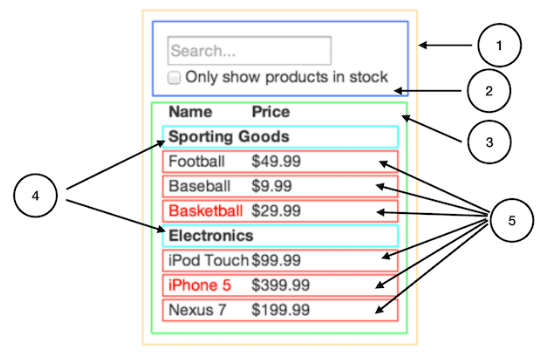

# PoC Software Pool 2022 - Day 05 - React

**Day purposes**

✔ Create your own User Interface (UI) with React and Chakra UI.

✔ Structure your UI.

✔ Test your UI.

✔ Make your UI responsive.

## Introduction

*[React](https://en.reactjs.org) is a Javascript librairy to build user interfaces.*

**What is a user interface ?**

A user interface (UI) is the point at which humans interact with a computer, a web site or an application.

For instance, your terminal is a user interface.

**What does this Javascript library allow us to do ?**

Thanks to React, you can build [*React Components*](https://en.reactjs.org/docs/components-and-props.html).

**What is a React component ?**

It's a Javascript function that returns a Javascript object representing a DOM element in memory.

All these DOM elements in memory compose the Virtual DOM.

> DOM stands for Document Object Model, which is the HTML representation of a web page.
> As a consequence, a DOM element is a part of the HTML representation of a web page.

This Virtual DOM is a copy of the Real DOM.

- The Real DOM is the HTML representation of the web page that the user sees. It's updated by [*queries*](https://burlingtoncodeacademy.github.io/webdev-prework-track/DOM_queries)
- The Virtual DOM is a copy of the Real DOM. It's automatically updated when the state of a React Component is updated. It automatically updates the Real DOM.

In fact, this is why *React is called React*. Because the Real DOM is automatically updated.

When you create a React component, you can specify when its states should change.

This is the magic. You no more need to update the Real DOM by hand ! 🪄

> Maybe you don't understand why this is awesome. It's because you haven't played yet with the Real DOM.\
> If you want, at the end of the day, build the same application without React. Then you will undertand. 👍
> Here's the [official DOM documentation](https://developer.mozilla.org/en-US/docs/Web/API/Document_Object_Model/Introduction).

**How to use React the right way ?**

***Build a tree of components ! Build a React Component for each element of your UI !***

Here's an example :
<div align="center">



</div>

Each number corresponds to a React Component.
> You can call React Components inside a React Component.

If you follow this until the end, you will get a [*single page app*](https://www.bloomreach.com/en/blog/2018/what-is-a-single-page-application).
> This means that your app is a single React Component, composed of React Components.

**Okay, this is great for developers ! How about users ?**

Building the Real DOM takes time.

Thus when a web page is loaded, the user wait a bit.

However if you have well used React, you build the Real DOM only one time (when the first page is loaded), then you just update it.

As a concequence, using React you give to your users ***a more fluid experience*** 🥇.

## Step 0 - Setup

In your pool repository, create a new directory for the `day05` :

```sh
mkdir -p day05
```

Then, create a new React project with Typescript in :

```shell
npx create-react-app artists-book --template typescript
```

To verify that everything is ok, run the following commands :

```shell
# Move to your project
cd artists-book

# Start the server
npm start
```

If you get a page with de React's logo spinning, then you can continue !

***

⚠️ ✋ ⚠️ ✋ ⚠️ ***Very Important*** ⚠️ ✋ ⚠️ ✋ ⚠️

***Before going further, take a moment to read the React [Getting Started](https://en.reactjs.org/docs/getting-started.html) and its tutorials.***

***Make sure to understand what is a [fonctional component](https://www.robinwieruch.de/react-function-component/), you have to use it for every component.***

***It's important to take at least 30 minutes to read these tutorials, it will save you a lot of time.***

***

## Step 1 - Lay the foundations

Now that you understand the **core concepts** of React, it's time to lay the foundations of your project.

### Clean Up

Remove some files to have the following glossary :

```sh
  ├──node_modules       # External modules required
  │   └──{...}
  ├--public             # Static files - https://create-react-app.dev/docs/using-the-public-folder/
  │   ├──index.html
  │   └──robots.txt     # Prevent crawl up - https://www.geeksforgeeks.org/robots-txt-file/
  ├──src                # The folder where you will code
  │   ├──App.tsx
  │   └──index.tsx
  ├──.gitignore         # Tells git to ignore some files
  ├──packge-lock.json   # Dependencies manager
  ├──package.json       # Package manager
  ├──README.md          # Don't hesitate to read it ! It contains usefull commands
  └──tsconfig.json      # TypeScript configuration file
```
> It's ok if some errors appear, it will be fixed.

Then follow these steps. It will setup your project with [Chakra UI](https://chakra-ui.com), a component librairy to help you to build your React projects, [ESlint](https://eslint.org) and [Prettier](https://prettier.io). It will also give you a good architecture.

### Installation

- Install Chakra UI :
```sh
npm i @chakra-ui/react @emotion/react@^11 @emotion/styled@^11 framer-motion@^5 @chakra-ui/theme-tools
```

- Update `src/index.tsx` :
```tsx
import React from 'react';
import ReactDOM from 'react-dom';

import { ChakraProvider } from '@chakra-ui/react';

import App from './app/App';

import theme from './theme';
import './theme/index.css';

ReactDOM.render(
	<React.StrictMode>
		<ChakraProvider theme={theme} resetCSS>
			<App />
		</ChakraProvider>
	</React.StrictMode>,
	document.getElementById('root'),
);
```
> Check the Chakra UI [tutorial](https://chakra-ui.com/guides/getting-started/cra-guide) to setup Create-React-App projects.

- Create the folder `src/theme`.
> Check the Chakra [documention](https://chakra-ui.com/docs/theming/customize-theme) about `theme`.

- Create the file `src/theme/index.css` and fill it with :
```css
/* Import fonts from google fonts */
@import url('https://fonts.googleapis.com/css2?family=Poppins:ital,wght@0,100;0,200;0,300;0,400;0,500;0,600;0,700;0,800;0,900;1,100;1,200;1,300;1,400;1,500;1,600;1,700;1,800;1,900&display=swap');
@import url('https://fonts.googleapis.com/css2?family=Roboto:wght@400;500&display=swap');

body {
  font-family: 'Poppins' !important;
}

html {
  scroll-behavior: smooth;
}
```

- Create the file `src/theme/index.ts` and fill it with :
```ts
import { extendTheme } from '@chakra-ui/react';
import { createBreakpoints } from '@chakra-ui/theme-tools';

// Set breakpoint to help to make the app responsive.
const breakpoints = createBreakpoints({
	xs: '320px',
	sm: '576px',
	md: '768px',
	lg: '1024px',
	xl: '1280px',
	'2xl': '1440px',
});

const overrides = {
	breakpoints,
};

export default extendTheme(overrides);
```

- Create the folder `src/app`.

- Create the file `src/app/App.tsx` and fill it with :
```tsx
import { Center, Spinner, Text, VStack } from '@chakra-ui/react';

const App = (): JSX.Element => (
	<>
		<Center mt="160px">
			<VStack spacing="32px">
				<Text>It's time for you to start your frontend development</Text>
				<Spinner w="132px" h="132px" />
			</VStack>
		</Center>
	</>
);

export default App;
```

- Add `"baseUrl": "src",` under `"compilerOptions": {` in `tsconfig.json`.
> Check the tsconfig [documentation](https://www.typescriptlang.org/tsconfig#baseUrl) about `baseUrl`.

- Install ESlint :
```sh
npm install -D eslint-config-airbnb eslint-config-airbnb-typescript eslint-config-prettier eslint-plugin-prettier
```

- Create the file `.eslintrc.yaml` and fill it with :
```yaml
parser: "@typescript-eslint/parser"

parserOptions:
  ecmaVersion: 6
  project: tsconfig.json

env:
  node: true
  browser: true

extends:
  - airbnb-typescript
  - airbnb/hooks
  - plugin:@typescript-eslint/recommended
  - prettier
  - react-app

plugins:
  - prettier

globals:
  "cy": true

rules:
  prettier/prettier: warn

  react/react-in-jsx-scope: 0
  react/no-unescaped-entities: 0
  react/jsx-props-no-spreading: 0
  react/require-default-props: 0
  react/no-children-prop: 0
  react-hooks/exhaustive-deps: off

  no-alert: 0
  no-console: 0
  no-nested-ternary: 0
  max-classes-per-file: 0
  class-methods-use-this: 0

  import/prefer-default-export: 0

  arrow-body-style: ["error", "as-needed"]

  "@typescript-eslint/no-non-null-assertion": off
  "@typescript-eslint/no-unused-vars": ["warn", { ignoreRestSiblings: true }]
  "@typescript-eslint/no-use-before-define": 0
  "@typescript-eslint/ban-ts-comment": off
```

- Add the following scripts to `package.json` :
```json
{
  "lint": "eslint src",
  "lint:fix": "eslint src --fix"
}
```

- Install Prettier :
```sh
npm install -D prettier
```

- Create the file `.prettierrc` and fill it with :
```json
{
  "semi": true,
  "trailingComma": "all",
  "singleQuote": true,
  "printWidth": 120,
  "tabWidth": 2,
  "useTabs": true,
  "bracketSpacing": true,
  "parser": "typescript"
}
```

- To finish, run the following commands.
```sh
# Run lint
npm run lint

# Start the server
npm start
```

You can continue if they all succeed !

Now that the foundations are laid for your project, it's time to start the frontend development !

***

⚠️ ✋ ⚠️ ✋ ⚠️ ***Very Important*** ⚠️ ✋ ⚠️ ✋ ⚠️

***Before going further, be aware of this :***

***As you are using Chakra UI, you mustn't use HTML tags. In fact, Chakra UI makes available plenty of components, such as Button, Box, Flex, Stack, ... You can find all the list [here](https://chakra-ui.com/docs/getting-started) on the left.***

***It's important to take at least 20 minutes to read this list, it will save you a lot of time.***

***For all the following steps, you will have three sections :***
- ***Requirements: what you must have***
- ***Constraints: what you must follow***
- ***Tips: what you must read and use***

***

### Your first component :rocket:

The first step is to create the Home page.

**Requirements :**
- The Home page must contain :
  - a title `Artists Book`
  - a subtitle `Manage your favorite artists`.

**Constraints :**
- Create the file `src/pages/Home.tsx` with a React Component representing your Home page inside.
- Update the file `src/app/App.tsx` to call this component.

**Tips :**
- Make sure you understood everything in the Clean Up.
- You should have a look to the Chakra UI [Text](https://chakra-ui.com/docs/typography/text) component.

Well done ! You have created your first React Component !

> A ***great idea*** is to create a folder `src/components` to store reusable components.

***

⚠️ ✋ ⚠️ ✋ ⚠️ ***Very Important*** ⚠️ ✋ ⚠️ ✋ ⚠️

***From now, you free to add any element you want in your UI as long as you have the requirements. Chakra UI is a really powerfull tool, have fun with it !***

***Don't hesite to ask us questions about design, about ways to code frontend elements, or to valid your architecture.***

[***Here is an example of what you will have to do***](https://pool-software-artists-book-47uohqzk7-pool-software-artists-book.vercel.app)
> Note that this is purely frontend. There is no interaction with a database.

***

## Step 2 - Your first routes

Now that you have your Home page, it's time to have Register and Login pages with the following urls : `/register` and `/login`.

**Requirements :**
- The Home page must contain :
  - A `link` to the Register page.
  - A `link` to the Login page.
- The Register page must contain :
  - An `input` to enter an `email`.
  - An `input` to enter a `password`. Text must be remplaced by dots.
  - An `input` to enter the `confirmed password`. Text must be remplaced by dots.
  - A `button` that when clicked, log the values of the email, the password and the confirmed password.
  - A `link` to the Login page.
- The Login page must contain :
  - An `input` to enter an `email`.
  - An `input` to enter a `password`. Text must be remplaced by dots.
  - A `button` that when clicked, log the values of the email and the password.
  - A `link` to the Register page.

**Constraints :**
- You must create the file `src/pages/Register.tsx`.
- You must create the file `src/pages/Login.tsx`.
- You must create the file `src/app/Routes.tsx` with a React Component containing the Routes inside, called in `src/app/App.tsx`.

**Tips :**
- You should have a look to the Chakra UI [Input](https://chakra-ui.com/docs/form/input), [Link](https://chakra-ui.com/docs/navigation/link) and [Button](https://chakra-ui.com/docs/form/button) components.
- You should have a look to the [react-router-dom](https://github.com/remix-run/react-router/blob/main/docs/getting-started/tutorial.md) package.
- You should have a look to the React [State Hook](https://en.reactjs.org/docs/hooks-state.html).
- Check the [web console](https://developer.mozilla.org/en-US/docs/Tools/Web_Console) to see the logs (Ctrl + Shift + I).

## Step 3 - What if you change the screen size ?

Now that you have several pages, its time to make sure that they are responsive on different screen size.

To do so, open the console and play with the screen width and height.

If some elements are not responsive, fix it !

**Requirements :**
- Check :
  - The arrangement of the elements.
  - The spaces between elements.
  - The text size (especially for titles and subtitles)
  - ...

**Tips :**
- Here is [how to do](https://chakra-ui.com/docs/features/responsive-styles) with Chakra UI. As you can see, the setup has already been done !

## Step 4 - Testing time

You now have three responsive pages.

Before going further, it's a good practice to create [end-to-end](https://css-tricks.com/front-end-testing-is-for-everyone/#h-end-to-end-e2e-testing) tests.

To do that, you will use [Cypress](https://www.cypress.io).

**Requirements :**
- Verify that the Home page contains :
  - One `Register` `button` redirecting to `/register`.
  - One `Login` `button` redirecting to `/login`.
- Verify that the Register page contains :
  - Three `inputs`.
  - One `Register` `button`.
  - One `Login` `button` redirecting to `/login`.
- Verify that the Login page contains :
  - Two `inputs`.
  - One `Login` `button`.
  - One `Register` `button` redirecting to `/register`.
- Add the following `scripts` to the file `package.json` :
  - `cypress:open`, running cypress with de GUI.
  - `cypress:run`, running cypress without the GUI.

**Constraints :**
- You must create the file `cypress/integration/home.spec.ts`
- You must create the file `cypress/integration/register.spec.ts`
- You must create the file `cypress/integration/login.spec.ts`

**Tips :**
- You will need to easily find components of you UI. Give them [`id`](https://developer.mozilla.org/en-US/docs/Web/HTML/Global_attributes/id?retiredLocale=id).

## Step 5 - Your first dashoard

Now that you have solid foundations, it's time to go further !

You have a Home page, a Register page and a Login page. What's missing ? A Dashboard page !

Let's now play with artists :rocket:

To see what is an `Artist`, check the [API doc](../resources/README.md).

Create a Dashboard page listing some artists, with the following url : `/dashboard`.

:warning: ***For now, any data is stored inside a React useState. There is no real database. No interaction with the API.*** :warning:

**Requirements :**
- Update the Register `button` to redirect to the Dashboard page when clicked.
- Update the Login `button` to redirect to the Dashboard page when clicked.
- The Dashboard page must contains :
  - A `navbar` in the top containing :
    - A `link` to the Dashboard page on the left.
    - A `button` `Add an Artist` on the right, **doing nothing for now**.
  - A `grid` listing artists's `card`.

**Constraints :**
- You must create the file `src/types/artist.ts` with the `Artist` type inside. Be smart, take only the needed properties :sunglasses:
- You must create the file `src/pages/Dashboard.tsx`.
- You must create the file `src/components/Bar/TopBar.tsx` with the top `navbar` inside.
- You must create the file `src/components/Button/AddArtistButton.tsx` with the `Add an Artist` `button` inside.
- You must create the file `src/components/Card/ArtistCard.tsx` with the artists's `card` inside, displaying every informations about an artist except from his `id`.
  > Try to display the `rating` using 5 stars :star:

**Tips :**
- You should have a look to the Chakra UI [Grid](https://chakra-ui.com/docs/layout/grid) component.
- You should have a look to the Chakra UI [Navbar](https://chakra-templates.dev/navigation/navbar) and [Cards](https://chakra-templates.dev/components/cards) templates.
> Be carefull with the Chakra UI templates. It's just to give you an idea of what you can do. ***Do not copy-paste code.***

## Step 6 - Become a true Frontend Developper

Now that you can list some artists, what if you can add artists ?

As you can notice, your `Add an artist` button does nothing for now.

Let's add artists in a cool way :sunglasses:: when this button is clicked, a `modal` appears with a form to create an artist.

**Constraints :**
- You must create the file `src/components/Modal/AddArtistModal.tsx` with the `modal` to add an artist inside, called in `src/components/Button/AddArtistButton.tsx`.

**Tips :**
- You should have a look to the Chakra UI [Modal](https://chakra-ui.com/docs/overlay/modal) component.

***

⚠️ ✋ ⚠️ ✋ ⚠️ ***Very Important*** ⚠️ ✋ ⚠️ ✋ ⚠️

First well done ! You've worked hard to be here :clap:

It's time to give you a gift : an advice.

One of the most difficult thing when you build a User Interface with React (and other librairy of components / frameworks), is to manage the dozens of components you create.

But why is it difficult ?

It's because your components are not ***stateless***. ***There is logic inside them***. For instance, sometimes you will copy-paste a whole component, just to change a condition, a function, ...

It's really difficult to build components that you can re-use in different parts of your project.

So how can you resolve this problem ?

One of the best thing to do is to build ***stateless components***.

Keep your logic, your function calling APIs, ... the higher in your tree component. Pass functions, conditions, ... ***as parameters*** to your components.

It might be not important, but I promise that it will help you so much.

To set this up, here is a little challenge you can take : all your logic, keep it inside the pages components. Only here.

If you want to go further in frontend development, follow this principle as much as you can.

***

## Step 7 - Your first API call from a UI

Now that you have build your User Interface, it's time to call the [API](../resources/README.md) and interact with real data.
> Please take a moment to setup this.\
> Feel free to play with it with Postman.

Let's call the API when a user register.

**Requirements :**
- The user must be notify with the **appropriate message** if the register action succeed or failed.
- The Register button cannot be clickable if the credentials are invalid.
- On success, redirect the user to the Dashboard page.

**Constraints :**
- You must have an [env variable](https://create-react-app.dev/docs/adding-custom-environment-variables/) `REACT_APP_BACKEND_URL`.
- You must get the `REACT_APP_BACKEND_URL` inside the file `src/config/services.ts`, and only here.
- You must create the folder `src/services` and keep the functions calling the API inside it. In your React components, you will call these functions. Be smart, your free to organise this folder as you want.

**Tips :**
- You should have a look to the [axios](https://www.npmjs.com/package/axios) package.
- You should have a look to the [env-var](https://www.npmjs.com/package/env-var) package
- You should have a look to the Chakra UI [toast](https://chakra-ui.com/docs/feedback/toast) component.
- You should have a look to the [localStorage](https://developer.mozilla.org/en-US/docs/Web/API/Window/localStorage), this is where you can keep the `accessToken`.

***

⚠️ ✋ ⚠️ ✋ ⚠️ ***Very Important*** ⚠️ ✋ ⚠️ ✋ ⚠️

***You will store the given `accessToken` inside the `localStorage`.***

***Note that this is a bad idea.***

***Please refer to the Security Bonus to understand why.***

***We ask you to do it this way because it's important to be aware of this.***

***

## Step 8 - Time to play with real data :rocket:

Now that you know how to call an API from a User Interface, it's time to have a complete interaction with it.

**Requirements :**
- On successfull login, redirect to the Dahsboard page.
- The user must be notify with the **appropriate message** on login.
- The user must be authentificate on the Dashboard page. If not, redirect to the Home page.
- The user must be notify with the **appropriate message** on artist creation.

**Constraints :**
- Follow the previous constraints. Structure your code.

**Tips :**
- You already have what you need.

## Step 9 - What about musics ?

Well, we have artists. What about musics ?

Create an Artist page listing all the artist's musics.

**Requirements :**
- When an artist is created, redirect the user to this artist's page.
- The Artist page must contains :
  - The same top `navbar` as the Dashboard page.
  - The photo / name / rating / nationality / music gender of the artist, displayed in a nice way.
  - An `Add a music` `button` opening a `modal` to add a music when clicked.
  - A `grid` listing his music's `card`.

**Constraints :**
- You must create the file `src/components/Card/MusicCard.tsx` with the musics's `card` inside, displaying every informations about a music except from its `id`.
- You must create the file `src/components/Button/AddMusicButton.tsx` with the `Add an Music` `button` inside.
- You must create the file `src/components/Modal/AddMusicModal.tsx` with the `modal` to add a music inside, called in `src/components/Button/AddMusicButton.tsx`.

**Tips :**
- This is not the time to optimize your number of requests to the API. Keep it logical.

## Bonus

### Animations

Improve your User Interface using animations.

Here are the best two librairies :
- [animate JS](https://animejs.com)
- [motion](https://www.framer.com/motion/)

We advice you to use Motion as it is already installed with Chakra UI.

### Dark & Light Mode

Implement a Dark and Light Mode thanks to [Chakra UI](https://chakra-ui.com/docs/features/color-mode) !

### Security Issue

Storing a JWT inside the localStorage is a bad idea. Here is [how to solve this problem](https://www.codeheroes.fr/2020/06/20/securiser-une-api-rest-3-3-gestion-du-jwt-cote-client/).

Your turn !

### React Context

What if you could share data between different components without passing parameters to them ?

Well it's possible, it's called [React Context](https://en.reactjs.org/docs/context.html).

Try to use it.

> Made with :heart: by PoC
